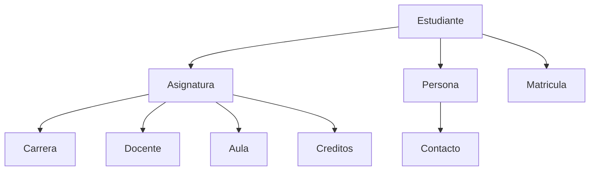

## Filosofia de la Clase y Evaluacion Diagnostica

El docente inicio la clase explicando que se realizaria una **evaluacion diagnostica** (sin nota) cuyo proposito es obtener estadisticas sobre el nivel de conocimientos previos del grupo para calibrar el avance del curso.

> [!important] Principio fundamental: equivocarse es valido
> Una de las reglas mas importantes en el proceso de formacion universitaria y academica es que **equivocarse es valido**. Lo que no esta bien es no aprender de los errores. Una vez que se sale de la universidad al campo laboral, el margen de error deberia ser minimo.

> [!example] Caso extremo: la NASA
> Si uno trabaja para la NASA y se equivoca en un calculo, las consecuencias pueden ser fatales, como la muerte de una tripulacion (se menciono el caso del Apollo). En el ambito academico el error es parte del aprendizaje, pero hay que corregirlo.

El docente promueve un modelo de **construccion colectiva del conocimiento**: los estudiantes participan, generan definiciones y conceptos, y el docente refuerza o corrige lo expresado. Si alguien comete un error al formular un concepto, no debe sentirse mal.

> [!warning] Verificar siempre lo que dice el docente
> El docente reconocio que el mismo puede equivocarse al explicar algun concepto. El conocimiento se genera cuando los estudiantes verifican lo que se les dice. Si nadie revisa, el error permanece. La verdad no se encuentra en Wikipedia, sino en libros digitales y fuentes formales que confirmen los conceptos.

---

## Importancia de Bases de Datos en el Ambito Laboral

Aunque **bases de datos** no es considerada la materia troncal mas fuerte de la carrera, el docente enfatizo que es una de las materias que mas ayuda a conseguir trabajo.

> [!example] Experiencia laboral del docente
> Uno de sus primeros trabajos fue con bases de datos, trabajando con **Oracle**. Utilizaban **procedimientos almacenados** (`stored procedures`) para hacer consultas y generar conexiones con las aplicaciones. Las aplicaciones consumian consultas almacenadas que extraian informacion de la base de datos y devolvian resultados. Se creaban programas intermedios para la comunicacion entre la base de datos y las aplicaciones. Era fundamental tener cuidado con donde y como se realizaban las consultas.

---

## Metodologia de Investigacion y Recopilacion de Informacion

El docente senalo que algunos estudiantes ya estan cursando o van a cursar **metodologia de investigacion**, y que hubiera sido ideal haberla llevado antes de esta materia.

En metodologia se ensenan instrumentos y tecnicas para recopilar informacion, tales como:

- **Encuestas** — formularios con preguntas estructuradas
- **Entrevistas** — conversaciones dirigidas para obtener informacion

Estas herramientas son fundamentales para el **analisis y diseno de bases de datos**, ya que todo desarrollo de software tiene por detras una base de datos. El diseno de una base de datos no surge de la imaginacion: requiere un proceso sistematico de recopilacion y analisis de requerimientos del cliente.

> [!tip] Recomendacion
> Para los proyectos del curso, los estudiantes deben identificar una herramienta de recopilacion de informacion (encuesta o entrevista) y aplicarla al sistema que deseen analizar.

---

## Tipos de Bases de Datos

### Bases de datos relacionales vs. no relacionales

Existen dos grandes tipos de bases de datos:

| Tipo | Descripcion | Ejemplo |
| --- | --- | --- |
| **Relacional** | Estructura tabular, usa SQL | MySQL, Oracle, SQL Server, Access |
| **No relacional** | Orientada a objetos u otros modelos, estructuras flexibles | [[MongoDB]] |

El docente menciono que las **bases de datos no relacionales** (como MongoDB) estan "de moda" y que muchos quieren usarlas, pero advirtio:

> [!warning] Eleccion de tecnologia
> El tipo de base de datos o la tecnologia que se debe utilizar **depende mucho del contexto y las necesidades del proyecto**. No se debe elegir una tecnologia solo porque esta de moda.

### Bases de datos vectoriales

> **Estudiante:** ¿Usted ha escuchado de las bases de datos vectoriales?
> **Docente:** Si, las he escuchado. Usualmente estan orientadas para **inteligencia artificial**, para **modelos de lenguaje grande** (LLMs) y para el **procesamiento del lenguaje natural** (NLP).

> [!note] Investigacion sobre bases de datos vectoriales y NLP
> El docente conto que tuvo un estudiante que investigaba procesamiento del lenguaje natural y descubrio que las bases de datos vectoriales se utilizan por la complejidad del analisis linguistico. Una de las limitaciones es que cualquier idioma tiene **jergas y modismos**: la manera de hablar en Santa Cruz es distinta a la de Cochabamba, La Paz, Tarija o Beni. Llevar esos modismos a que la inteligencia artificial los entienda e identifique patrones era justamente el trabajo que se hacia con bases de datos vectoriales.

---

## Evolucion: De Excel a los Gestores de Bases de Datos

### Excel como punto de partida

**Excel** fue una de las primeras herramientas para almacenar datos. Se llenaban datos manualmente en planillas. En algun momento alguien dijo: "los datos de Excel se pueden llevar a otro contexto, a una arquitectura que permita diferenciar y armar informacion de manera mas estructurada."

### Primeros gestores de bases de datos

Asi surgieron los **gestores de bases de datos**. Uno de los mas antiguos es **Access**. Otros aun mas antiguos incluyen **Informix**, un gestor orientado exclusivamente para trabajar con **Unix**.

> **Estudiante:** Eso es lo que esta basado en Linux, ¿no?
> **Docente:** Mas bien, Linux esta basado en Unix. Habia un academico que tenia un sistema operativo solo para estudiantes, y despues Linus Torvalds saco su kernel.

> [!note] Unix y seguridad bancaria
> Unix es uno de los sistemas operativos mas viejos y tradicionales, y sigue siendo utilizado por la **banca** por su seguridad. No es que sea de "bajo nivel", sino que es un entorno complejo de analizar, lo cual hace que los hackers no quieran estudiarlo. Al no ser popular, no lo estudian para hackear, y se enfocan en sistemas mas populares.

> [!example] iOS y seguridad por oscuridad
> De manera similar, los dispositivos Apple (iOS) no eran hackeados frecuentemente porque la poblacion de usuarios era pequena y no habia tanto incentivo economico. Sin embargo, esa historia ha cambiado: hoy se escucha de hackeos a iCloud y desvinculacion de dispositivos, aunque el docente nunca ha visto que realmente se logre desvincular un dispositivo.

---

## Microsoft Access: Primera Exploracion

### Interfaz y conceptos basicos

Cuando se abre Access, se presenta un entorno similar a Excel pero mas orientado a bases de datos. La primera pagina permite gestionar bases de datos. Al crear una tabla nueva, Access muestra:

- Una **columna ID** autogenerada que no se puede modificar (identificador unico de cada fila)
- La opcion "Haga clic para agregar" para crear nuevas columnas

### Terminologia fundamental

> [!important] Terminologia de bases de datos

| Termino en lenguaje comun | Termino en bases de datos | Descripcion |
| --- | --- | --- |
| Columna | **Atributo** | Nombres asignados a cada columna; deben ser unicos y descriptivos |
| Fila | **Tupla** | Cada registro individual de la tabla |

> **Docente:** No se llaman filas cuando estamos manejando bases de datos. ¿Que se llama?
> **Estudiante:** Atributo, ¿no?
> **Docente:** Atributo es la columna. La fila es...
> **Estudiante:** Tuplas.
> **Docente:** Tuplas, se les llama tuplas.

> [!warning] No olvidar esta terminologia
> Cuando lleguen a una entrevista laboral, no les van a decir "filas": les diran "analicen las tuplas de los atributos tales." Es fundamental manejar ambos terminos, pero no olvidar la nomenclatura formal.

### Ejercicio: explorar Access

El docente pidio como primer ejercicio:

1. Explorar Access
2. Trabajar con una sola tabla (la tabla de estudiante o registro)
3. Trasladar lo que hicieron en Excel a Access
4. Revisar las bases de datos prediseñadas que Access ofrece (contactos, ventas, compras, etc.)
5. Abrir alguna prediseñada y analizar como esta construida

---

## Diseno de Bases de Datos: Entidades y Relaciones

### Ejemplo del sistema "Estudiante"

El docente planteo el analisis de un estudiante como entidad principal, descomponiendolo en multiples componentes:

> **Docente:** ¿Que componentes podria tener un estudiante para separarlo? El estudiante no sera solamente "estudiante". ¿Como puedo dividirlo en elementos?

La discusion en clase genero las siguientes entidades:

**Entidades identificadas y sus atributos:**

| Entidad | Atributos |
| --- | --- |
| **Persona** | Carnet de identidad, nombre |
| **Matricula** | Fecha de matricula, monto, año |
| **Contacto** | Numero de celular, correo electronico, Facebook, Twitter, etc. |
| **Asignatura** | Siglas, creditos |
| **Carrera** | (por definir) |
| **Docente** | (es una Persona) |
| **Aula** | Numero de pupitres, proyector, computador, pizarron |

> [!important] Separar datos de persona y datos de contacto
> No se deben mezclar los datos de la persona como tal (CI, nombre) con los datos de contacto (celular, correo). Hay que aprender a diferenciarlos. Esta analogia aplica a cualquier tipo de objeto.

> **Estudiante:** ¿El aula no seria un atributo?
> **Docente:** No te olvides una cosa: el aula tiene una descripcion, tiene numero de pupitres, proyector, computador, pizarron. Esos elementos tienen que describirse. Si te asigno el aula 24, ¿que caracteristicas tiene? 50 computadoras, dos ordenadores... y esos son sus atributos. El aula es una entidad, no un atributo.

> **Estudiante:** ¿Practicas igual podria entrar?
> **Docente:** ¿Por que piensas que podria entrar practicas? Hemos empezado con el tema del estudiante y hemos llegado a asignatura, aula, docente, creditos, carrera. ¿Tus practicas donde irian?

### Ejemplo alternativo: Club de Futbol

Para demostrar que el mismo esquema es adaptable, se propuso un club de futbol:

> **Estudiante:** Un club de futbol.
> **Docente:** ¿Que tienes en el club de futbol?
> **Estudiante:** Jugador, entrenador.

| Sistema Estudiante | Sistema Club de Futbol |
| --- | --- |
| Estudiante | Jugador |
| Asignatura | Entrenamiento |
| Carrera | Equipo |
| Creditos | Cuotas (ahora se paga por pertenecer) |
| Docente | Director Tecnico (DT) |
| — | Liga |
| — | Sponsors / Presidente |

> [!important] Reutilizacion de la entidad Persona
> Tanto el DT como el docente **son personas**. La entidad Persona solo almacena datos generales (CI, nombre). La diferenciacion entre estudiante, docente, jugador o DT se hace en entidades separadas. Cuanto menos contaminacion tenga la informacion, mejor.

---

## El Problema de la Redundancia

El docente explico que cuando se unen todas las tablas sin un diseno adecuado, se genera **redundancia**:

> [!example] Redundancia en la tabla unificada
> Si uno une estudiante + matricula + asignatura + carrera + docente en una sola vista:
>
> | Estudiante | Matricula | Asignatura | Carrera | Docente |
> | --- | --- | --- | --- | --- |
> | JJ | 23 | 01 | Ing. Software | P |
> | JJ | 23 | 02 | Ing. Software | JP |
>
> Se repite "JJ", "23", "Ing. Software" en cada fila. Esto crece exponencialmente cuando el estudiante tiene mas datos (CI, nacionalidad, etc.). En terminos de tamaño y espacio, consume recursos del servidor, y al consultar hay que revisar registro por registro (como en estructuras de datos con filas y colas).

> [!warning] Cuidado con los formatos y la redundancia
> La redundancia se hubiera generado aun mas si se hubiera quitado la entidad Persona y Contacto como entidades separadas, concentrando toda la informacion en una sola tabla.

---

## Definicion Formal de los Sistemas de Gestion de Bases de Datos (SGBD)

> [!abstract] Definicion de SGBD
> Un **Sistema de Gestion de Bases de Datos** (SGBD) es una **coleccion organizada de datos interrelacionados y programas** que permiten acceder a dicha informacion de forma **segura y eficiente**.

> [!abstract] Objetivo principal
> Ofrecer un **entorno conveniente** que facilite la **recuperacion y almacenamiento adecuado** de la informacion para los usuarios y las aplicaciones.

Al seleccionar una base de datos, se deben considerar:

- Que la consulta sea **simple**
- Que el acceso a la informacion sea **seguro**
- Que se garantice la **integridad** de la informacion

---

## Integridad de los Datos

### Definicion

> **Docente:** ¿Que es integridad?
> **Estudiante:** Que los datos se mantengan, que no se pierdan.
> **Estudiante:** Garantizar la exactitud y consistencia.
> **Docente:** Esos son los terminos mas importantes. Tenemos que garantizar que la informacion sea como tiene que ser.

> [!important] Integridad de datos
> La **integridad** de los datos implica garantizar su **exactitud y consistencia**. La informacion debe ser precisa: 1 + 1 debe ser igual a 2 en la base de datos.

### Ejemplo: Fraude electoral de 2019 en Bolivia

> **Docente:** ¿Ustedes han escuchado hablar del fraude electoral del 2019?
> **Estudiantes:** Si, en noviembre.
> **Docente:** ¿Como creen que fue el fraude?
> **Estudiantes:** Manipulacion de estadisticas, manipulacion de los datos, que son los votos, en las actas, en la base de datos.

> [!example] Fraude electoral y falta de integridad
> La base de datos del organo electoral no fue hackeada, sino **manipulada**. La informacion era **corrupta, no integra**: la suma de votos por partido deberia dar igual al numero de votos validos, pero al hacer el analisis, los numeros no cuadraban. Habia actas duplicadas y nombres duplicados.
>
> El docente menciono que en su experiencia fue designado como **jefe nacional de seguridad** del organo electoral y tenia el archivo Excel de los votos para analisis.

---

## Diferencias entre Excel y un SGBD

> **Estudiante:** No es un gestor de base de datos...
> **Docente:** ¿Que seria Excel si no es un gestor?
> **Estudiante:** Hojas de calculo.
> **Docente:** Hojas de calculo. Planillas de calculo. Pero no es una base de datos.

| Caracteristica | Excel (Planilla) | Base de datos (SGBD) |
| --- | --- | --- |
| **Consultas** | Sobre una planilla, tablas dinamicas, filtros manuales | Cruces de informacion entre multiples tablas con SQL |
| **Programacion** | Macros (VBA), limitada | SQL completo, procedimientos almacenados |
| **Independencia de tablas** | Si borras el archivo, se borran todas las pestañas | Si borras una tabla, las demas se mantienen intactas |
| **Almacenamiento fisico** | Un solo archivo | Almacenamiento distribuido e independiente por tabla |
| **Relaciones entre tablas** | No nativo | Relaciones formales mediante claves |
| **Consultas SQL** | No se puede hacer SQL en Excel | SQL es el lenguaje nativo |

> [!note] Aclaracion sobre macros en Excel
> Excel tiene por detras lo que se llaman **macros**, que son programables y pueden permitir hacer consultas sobre planillas. Sin embargo, Excel no tiene la infraestructura de un SGBD y su capacidad de almacenamiento es limitada.

---

## Introduccion a SQL

### ¿Que es SQL?

> **Docente:** ¿Que es una consulta SQL?
> **Estudiante:** Una instruccion para que la base de datos devuelva ciertos datos.
> **Docente:** Exactamente. Tu le preguntas y le dices: "Quiero que me devuelvas las 10 primeras tuplas de la tabla con los atributos A, B, C." Y eso te devuelve un resultado.
> **Estudiante:** Lo dice en el nombre, ¿no? Lenguaje de consultas estructuradas.
> **Docente:** Si, en el mismo nombre.

**SQL** = **Structured Query Language** (Lenguaje de Consultas Estructuradas)

### Operaciones sobre tablas (DDL - Data Definition Language)

A nivel de **tablas**, se pueden realizar estas operaciones:

| Operacion | Comando SQL | Descripcion |
| --- | --- | --- |
| Crear tabla | `CREATE` | Crear una nueva tabla |
| Alterar tabla | `ALTER` | Modificar atributos, agregar condiciones |
| Eliminar tabla | `DROP` | Eliminar una tabla completa |

> [!note] Pronunciacion en ingles
> El docente hizo que toda la clase repitiera en voz alta las palabras en ingles: **CREATE**, **ALTER**, **DROP**. "Cuando esten en exposicion, tienen que decirlo con ganas."

### Operaciones sobre tuplas (DML - Data Manipulation Language)

A nivel de **filas (tuplas)**, las operaciones son:

| Operacion | Comando SQL | Descripcion |
| --- | --- | --- |
| Seleccionar | `SELECT` | Consultar datos |
| Insertar | `INSERT` | Agregar nuevas tuplas |
| Actualizar | `UPDATE` | Modificar tuplas existentes |
| Eliminar | `DELETE` | Borrar tuplas especificas |

Otras operaciones mencionadas por los estudiantes:

- **JOIN** — para hacer intersecciones y relacionar tablas entre si
- **Funciones de agregacion** — calculos, estadisticas
- **Reportes** — la finalidad de manejar bases de datos, mas alla de almacenar, es generar reportes

---

## Instalacion de MySQL

El docente indico que los estudiantes deben descargar e instalar **MySQL** en sus computadoras.

### Diferencia entre Access y MySQL

> **Estudiante:** En Access solo es un archivito, pero en MySQL veo que hay que ingresar usuario y contraseña y es mas complejo.

| Aspecto | Access | MySQL |
| --- | --- | --- |
| **Naturaleza** | Archivo portable | Servidor de bases de datos |
| **Portabilidad** | Se copia el archivo y se usa en otra PC | No es directamente portable |
| **Seguridad** | Contraseña opcional del archivo | Usuario y contraseña del servidor |
| **Complejidad** | Sencillo, interfaz grafica | Mas complejo, requiere instalacion de servidor |

> [!tip] Sobre la portabilidad de MySQL
> MySQL maneja carpetas y archivos que se crean al instalar. Tecnicamente se puede mover toda esa carpeta, pero hay riesgo con la configuracion: se necesita el mismo entorno y tecnologia. Una mejor alternativa es usar **Docker** para contenerizar la base de datos.
>
> **Estudiante:** ¿Y con Docker?
> **Docente:** Si ya manejan algo de Docker, pueden contenerizar contenedores de aplicaciones y hacer mucho mas facil el uso de estas herramientas.

> [!warning] No poner contraseña en la instalacion academica
> En la primera instalacion de MySQL Server, por defecto no es necesario colocar contraseña, aunque hay recomendaciones de hacerlo. A nivel academico **no se recomienda** poner contraseña porque los estudiantes la olvidan y pierden todo su proyecto. Si olvidan la contraseña del usuario ROOT, tienen que reinstalar desde cero.
>
> **Recomendacion:** Instalacion limpia, sin niveles de seguridad. Siguiente, siguiente, siguiente.

> [!example] Anecdota sobre seguridad y etica
> Cuando un estudiante pregunto como hacer portable una base de datos MySQL, el docente bromeo con que es "sospechoso": imaginar que un banco trabaje asi y alguien quiera sacar una copia portable de la base de datos con todas las cuentas bancarias seria peligroso. "Estas en la Catolica. Te voy a invitar a la pastoral para una charla motivacional."

---

## Abstraccion de los Datos y Proyecto de Curso

### Informacion y datos

> **Docente:** ¿Que vendria a ser informacion?
> Un **conjunto de datos** logico, estructurado, que describe y define algo. De ese conjunto de datos, hay que clasificarlos y armar cierto tipo de informacion para poder almacenarla en una base de datos.

### CRM como ejemplo de sistema

> **Estudiante:** Un CRM.
> **Docente:** ¿Que es un CRM?
> **Estudiante:** Customer Relationship Management.

**CRM** = **Customer Relationship Management** (Gestion de la Relacion con Clientes)

Son sistemas dedicados a gestionar, controlar y hacer seguimiento a los clientes de una empresa. Estan relacionados con agendas de contactos y permiten la **toma de decisiones**:

> [!example] Toma de decisiones con una base de datos
> "Quiero los 10 primeros contactos de mi agenda para mandar una promocion." Se hace un `SELECT` de esa tabla de los 10 primeros y a esos se les envia la promocion. Se toman decisiones a partir de la informacion almacenada.

### Logica de negocio en el diseno

> [!important] Centrarse en el contexto y la logica del negocio
> Cuando se disena una base de datos, la informacion almacenada debe tener **relacion con el contexto del negocio**. No tiene sentido guardar datos de mascotas en una empresa de cemento. Sin embargo, en la banca podria interesar saber si un cliente tiene mascotas para ofrecer promociones de credito con seguro para mascotas... aunque no sea muy coherente.
>
> Lo que si interesa en la banca: que clientes pagan a tiempo, cuales son morosos, cuales tienen retrasos de mas de 10 dias.

### Machine Learning y bases de datos

> **Estudiante:** De eso tiene un sistema de machine learning, ¿no?
> **Docente:** Ese es ya otro nivel, pero se puede consultar la base de datos, extraer clientes que pagan a tiempo, y con [[machine learning]] generar campañas de incentivos o concientizacion. Se definen parametros, se crean reglas, y el motor de inferencia aprende a generar campañas automaticas para clientes potenciales.

> **Estudiante:** Eso igual se hace para las elecciones, ¿no? Campañas politicas.
> **Estudiante:** ¿No vio lo de Cambridge Analytica?
> **Docente:** Si, es viejisimo pero super famoso. Algo asi hicieron y siguieron haciendo.

---

## Integridad de Datos: Casos Reales del Organo Electoral y el Censo

### Auditoria del sistema electoral

> [!example] Auditoria del organo electoral en Cochabamba
> El docente conto que en Cochabamba le abrieron las puertas del organo electoral para auditar el sistema, invitados a traves de la Universidad Catolica por el monseñor.
>
> Al llegar, pregunto por el acceso a la base de datos: "No, no pueden acceder." Entonces propuso hacer pruebas con el sistema.
>
> **La prueba:** Cuando se quiere validar duplicados, uno se saca fotos y registra diferentes numeros de CI. El sistema **no deberia permitir** registrar dos veces la misma huella con diferentes numeros de identidad.

> **Estudiante:** En una base de datos, ¿como se guarda la huella?
> **Docente:** Es un objeto. Los objetos que se guardan se pueden analizar, pero lo dificil es identificar duplicados. La tarea mas dificil era esa: sacar una huella, cruzarla con toda la base de datos para ver si hay una igual, luego otra, y asi sucesivamente. ¿A quien le va a interesar hacer ese trabajo?

### Duplicados en el padron electoral

Se encontraron problemas graves:

- Huellas digitales duplicadas con diferentes numeros de carnet de identidad
- Personas registradas hasta **cinco veces** con cinco carnets distintos
- La misma foto, la misma huella, con cuatro nombres y cuatro numeros de CI diferentes

> [!note] Eliminacion de la abreviacion de ciudad en el CI
> Antes, el carnet de identidad incluia la abreviacion de la ciudad. Al quitarla, se abrio una puerta para generar aun mas duplicados.

### Depuracion de la base de datos

> **Estudiante:** ¿Como se llama? Purgador...
> **Docente:** Depuracion. Depuracion de la base de datos del registro de ciudadanos.

En las elecciones de 2019 habia registrados aproximadamente 13 millones de personas, pero tras la depuracion quedaron 7-8 millones. Los 3-4 millones restantes correspondian a registros duplicados utilizados para el fraude.

> [!note] Fraude en la segunda eleccion (Lucho Arce)
> Para la segunda eleccion corrigieron el problema de los calculos de votos, pero la manipulacion paso a ser a nivel de la **cantidad de poblacion**.

### El censo y el fraude

> **Docente:** El censo tambien fue complice de parte de los fraudes. ¿Como te dabas cuenta? Poblaciones que no deberian pasar de 125 personas tenian 400-500 personas votando.
> **Estudiante:** Y le asignan recursos en base a eso.

Cuando se levantaba informacion del censo, habia poblaciones con numeros redondeados e inflados (200, 300 personas donde solo habia 100).

---

## Tareas y Proximos Pasos

> [!todo] Tarea para el fin de semana
> 1. **Explorar Access**: crear una base de datos (puede ser prediseñada), analizar que atributos tiene, que tuplas se pueden generar
> 2. **Definir la idea del proyecto de curso**: venir a la siguiente clase con una propuesta de proyecto para bases de datos
> 3. **No instalar MySQL aun con contraseña**: esperar indicaciones

> [!todo] Proyecto de fin de curso
> - Cada estudiante debe proponer un tema/proyecto
> - Se analizara la idea en clase, extrayendo informacion relevante
> - Se identificaran entidades, atributos y relaciones
> - Se construira paulatinamente a lo largo del semestre
> - Primero se crearan tablas de manera "ciega" y en el proceso se identificaran las relaciones necesarias
>
> **El docente prefiere que los estudiantes partan del error:** crear tablas inicialmente sin relaciones formales y descubrir en la practica por que las relaciones son necesarias.

### Ideas de proyecto mencionadas en clase

- Club de futbol
- CRM (gestion de clientes)
- Sistema electoral (encuestas y analisis de tendencias de votantes)
- Agenda de contactos
- Cafeteria

> [!success] Resumen de la clase
> - Se definio que es un SGBD y su objetivo principal
> - Se diferenciaron planillas de calculo (Excel) de verdaderos gestores de bases de datos
> - Se aprendio la terminologia: **atributos** (columnas) y **tuplas** (filas)
> - Se introdujeron los comandos DDL (`CREATE`, `ALTER`, `DROP`) y DML (`SELECT`, `INSERT`, `UPDATE`, `DELETE`)
> - Se analizo el concepto de **integridad de datos** con ejemplos reales
> - Se exploro el concepto de **redundancia** y por que es problematica
> - Se inicio la reflexion sobre el proyecto de curso
