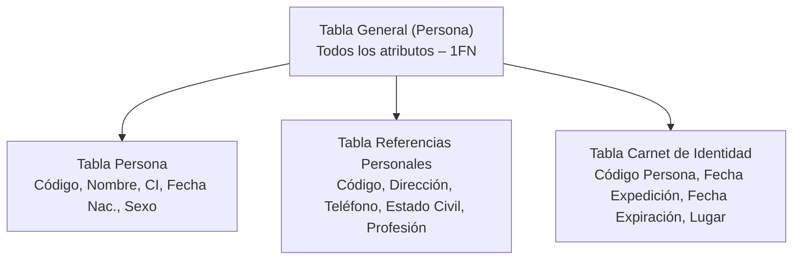
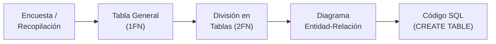

## ¿Qué es una Base de Datos?

> **Profesor:** Pregunta de retroalimentación. ¿Qué es una base de datos?
> **Estudiantes:** Información... un repositorio donde se guardan datos. Múltiples datos. Información almacenada.
> **Profesor:** Me gusta el tema de información almacenada. Una base de datos es un **conjunto de datos que van a estar relacionados entre sí**.

Lo que se hace en Excel — una tablita con información — **todavía no es una base de datos**. Una tabla con dos campos básicos y sencillos no puede llamarse base de datos. Se convierte en base de datos cuando hay **múltiples tablas con datos relacionados** entre sí.

> [!important] Contexto de la clase
> Nosotros ya tenemos que empezar a visualizar nuestras bases de datos para nuestros proyectos. Hay que entender ejemplos para poder desarrollar, porque si yo no entiendo una base de datos, no voy a poder desarrollarla.

---

## Análisis de una Entidad: Persona

### Identificación de Atributos Iniciales

Se partió del ejemplo de una **persona** y la pregunta: ¿qué información interesa de esa persona?

Los primeros atributos identificados:

1. **Nombre** (nombre completo)
2. **Carnet de identidad**
3. **Fecha de nacimiento**

> **Profesor:** Puedo ir agregando campos. Pero, ¿cuántos atributos debería tener una tabla para que sea lo ideal para poder manipular? Si yo coloco el tema de teléfono, ¿será necesario? ¿Con qué información yo tendría que cruzar esa tabla para que tenga razón de existir el número de teléfono?

### El Carnet de Identidad como Fuente de Datos

El profesor pidió a los estudiantes que **sacaran su carnet de identidad** para analizar qué datos contiene:

- Nombre
- Carnet de identidad
- Fecha de nacimiento
- **Fecha de expiración** (por este dato te das cuenta que tienes que renovarlo)
- Lugar de expedición
- Dirección / Domicilio
- Sexo

> **Profesor:** Voy colocando solamente en la tabla de persona atributos que sean **relevantes e importantes** para mi análisis. En algún momento dado, cuando desarrolle aplicaciones, yo podría tener una aplicación que me permita hacer el registro de carnet de identidad o datos personales.

### Aplicación de Ejemplo: Validocum

> **Profesor:** ¿Conocen alguna aplicación que pueda gestionar y manejar sus carnets de identidad?
> **Estudiantes:** No.
> **Profesor:** Van a buscar en sus aplicaciones una que se llama **Validocum** (para Android y para iOS). Ahí ustedes van a poder subir su carnet de identidad, licencia de conducir, pasaporte. Y con eso van a poder empezar a tener ese registro. Vamos a hacer este pequeño ejercicio para ver qué datos son importantes para mi registro.

### Atributos Adicionales: Referencias Personales

Continuando con el análisis, se identificaron más datos de la persona:

- **Lugar de expedición** del carnet
- **Dirección / Domicilio**

> **Estudiante:** ¿Y para qué sirve el estado civil?
> **Profesor:** ¿Por qué te sirve? Para que no te demanden. En el caso de que tengas hijos y no seas reconocido y tienes tu amante, te podían demandar antes. Tu esposa porque tenías amante te denunciaba y te quitaban todo, o al revés: si tú le pillabas a tu mujer con otro, la demandabas y perdía todo derecho. Ahora ya no hay esos derechos. Pero el estado civil solamente te da tu **estatus actual en la sociedad**: soltero, casado, divorciado. Hay el tema de la profesión también, pero miren, la tabla sigue creciendo. Son muchos atributos.

---

## De la Tabla General a la División: Formas Normales

### Primera Forma Normal (1FN): La Tabla General

> **Profesor:** Esa tabla que va creciendo, nosotros la conocemos como una tabla en la **primera forma normal**. ¿Por qué? Porque tiene mucha información y no está dividida todavía en componentes que me permitan relacionarlos.

Para la tabla de **persona**, los atributos relevantes son:

- Nombre
- Carnet de identidad
- Fecha de nacimiento
- Sexo
- Dirección

> **Profesora:** ¿Qué me interesa saber?
> **Estudiantes:** La dirección.
> **Profesor:** La dirección nada más. Probablemente la dirección nada más. Son datos relevantes, son los más importantes.

### Proceso de Generalización y División

Esa persona tiene **datos de referencia** adicionales. El profesor mostró cómo generalizar:

> **Profesor:** Si yo estoy hablando que una persona tiene referencia del domicilio, esto puedo agruparlo como "dirección". Aparte de dirección tiene un número de teléfono. El domicilio tiene **referencias personales**. Voy generalizando los términos, estoy recopilando información y los estoy generalizando: dirección, teléfono, estado civil, profesión. Ya estoy dividiendo mi tabla.

Lo que faltaba por ubicar: fecha de expiración y lugar de expedición del carnet.

### Segunda Forma Normal (2FN): Tablas Divididas

> **Profesor:** La **segunda forma normal** es dividir en más elementos significativos de la información que me permita identificar propiedades de estos elementos.

La tabla general se transforma en **tres tablas**:

> **Profesor:** La tabla persona se va a transformar. Ya no se va a hablar solo de una persona, se va a llamar también **tabla carnet de identidad**, porque me va a recopilar toda la información que yo tengo en mi carnet.

---

## Ejemplo con Datos Concretos

### Tabla 1: Persona

| Código | Nombre | CI | Fecha Nac. | Sexo |
| ------ | ------ | -- | ---------- | ---- |
| 1 | Peppe | 1 | 07/07/1979 | Masculino |
| 2 | Sofía | 3 | 01/01/1988 | Femenino |
| 3 | Carla | 6 | 01/01/1990 | Femenino |

> **Profesor:** Cuando yo estoy hablando del código, puede ser que sea lo mismo que un carnet de identidad.

### Tabla 2: Referencias Personales

> **Profesor:** ¿Qué es lo que puedo hacer para relacionar esas personas con direcciones?
> **Estudiante:** El código se repite.
> **Profesor:** El código puedo repetir. Entonces, para el código número uno...

| Código | Dirección | Teléfono | Estado Civil | Profesión |
| ------ | --------- | -------- | ------------ | --------- |
| 1 | Juan Pablo II | 1234 | Soltero | Estudiante |
| 2 | Juan Pablo II | 3205 | Casada | — |

> **Profesor:** Carla no tiene dirección, teléfono ni datos personales registrados.

### Tabla 3: Carnet de Identidad

> **Profesor:** Voy a colocar código persona. Ese código persona va a tener una fecha de expedición y un lugar de expedición del carnet de identidad.

| Código Persona | Fecha Expedición | Fecha Expiración | Lugar |
| -------------- | ---------------- | ---------------- | ----- |
| 1 | 08/11/2004 | 08/11/2025 | CB |
| 2 | 09/01/2025 | — | LP |
| 3 | 01/01/2028 | — | SC |

> **Profesor:** ¿Han encontrado algún error? En lugar solamente debería colocarme **códigos**: CB, LP, SC. Hay datos que no son correctos. Tengo Cochabamba, tengo La Paz, tengo Santa Cruz.

> [!warning] Errores identificados en el ejemplo
> - Usar nombres completos ("Cochabamba") en lugar de **códigos cortos** ("CB") para campos de referencia.
> - Datos inconsistentes o incoherentes entre tablas.
> - Personas sin registros en tablas secundarias (Carla no tenía referencias personales).
> - Fechas que no tienen sentido lógico.

---

## Tangente: Cambios en el Carnet de Identidad Boliviano

> [!example] Caso Real: El Carnet de Identidad del Estado Plurinacional
> Se generó una discusión en clase sobre los cambios en el carnet de identidad boliviano.
>
> **Estudiante:** ¿Dónde ha sido expedido el carnet? Me dice que no soy yo. Perdón.
> **Profesor:** No, antes los carnets colocaban más datos.
> **Estudiante:** Igual sería sexo. ¿Por qué ya no sale?
> **Profesor:** Ah, ya no hay. Todos somos neutros.
>
> Los estudiantes notaron que el **nuevo carnet del Estado Plurinacional** ya no incluye:
> - **Sexo**
> - **Dirección exacta**
> - Otros datos que sí aparecían en el carnet anterior (de la República)
>
> **Estudiante:** Es la primera vez que revisé la selfie y dijo que no reconocía que era yo.
> **Estudiante:** Antes decía tu dirección exacta, ahora ya no.
> **Estudiante:** Yo lo perdí mi carnet, necesitaba para votar.
> **Profesor:** Eres un número más.
>
> Este ejemplo es relevante para el diseño de bases de datos: los **requisitos de datos cambian con el tiempo**, y lo que antes era un campo obligatorio puede desaparecer en versiones posteriores.

---

## Diseño de Atributos: Buenas Prácticas

### Edad vs. Fecha de Nacimiento

> [!tip] No almacenar la edad directamente
> La persona puede tener edad, pero la edad se puede **calcular con la fecha de nacimiento**. No hay que hacerse mucho de eso. Solamente colocas la fecha de nacimiento y ya puedes calcular la edad.

### Nombre Completo vs. Campos Separados

Se puede dividir el nombre en campos individuales:

- Primer nombre
- Segundo nombre
- Apellido paterno
- Apellido materno

> [!warning] Campos obligatorios vs. opcionales
> Hay que tener cuidado porque hay personas que **no tienen apellido materno**, solamente es primer nombre y su apellido. Hay que definir cuáles campos son **obligatorios (mandatorios)** y cuáles son opcionales:
> - **Obligatorio:** Primer nombre, Apellido paterno
> - **Opcional:** Segundo nombre, Apellido materno (puede quedar en blanco)

### El ID (Identificador Único)

Cada tabla debe tener un **identificador único** (ID):

- Se recomienda que sea **generado automáticamente** por el sistema (autonumérico: 1, 2, 3...).
- Es un número **corto y secuencial**.
- Es **más eficiente** para consultas que usar campos largos como el carnet de identidad.
- **Cada tabla** tiene su propio ID.

> [!important] ¿Por qué usar un ID separado en lugar del carnet de identidad?
> El carnet de identidad tiene **más de 5 dígitos** y eso puede generar conflictos al momento de hacer búsquedas en función al tiempo. Cuanto más grande sea tu campo, cuando estés haciendo una consulta, te va a llevar **mucho tiempo**. El código va a ser cortito, pequeñito, y cuando hagas consultas va a ser más directo y más rápido.
>
> En las aplicaciones que nosotros vayamos a hacer, es muy poco probable que tengamos millones de registros. Entonces se recomienda usar el ID automático.

### Llave Primaria (Primary Key)

> **Profesor:** Cuando ustedes vean sus tablas, van a tener esta llavecita. ¿Saben qué significa esta llave? Esa llave significa que va a ser **única**, que no se va a poder repetir. No vas a tener un doble registro. Esa llave te va a dar la **garantía de que tus datos son únicos y no están duplicados**.

### Nombres de Variables y Alias

> **Estudiante:** ¿Cómo recomienda poner el nombre a las variables?
> **Profesor:** No tienen que ser largas. Tienen que ser **cortas**. Miren: FK, PK. FK, ¿qué significa? Foránea (Foreign Key). Y PK es Primary Key. No utilizan nombres largos para hacer las descripciones. Tienen que ser cortos, porque cuando ustedes están haciendo consultas a las bases de datos, si el nombre es muy largo, te va a consumir **tiempos y recursos**.

> **Estudiante:** He visto que se le pone como `AS` y otro nombre... se puede renombrar una variable para que sea solo para...
> **Profesor:** Tú estás hablando a nivel de programación. Para que ustedes generen **código limpio**, no utilicen nombres largos o difíciles de escribir. Tiene que ser lo más **descriptivo** posible.

> **Estudiante:** Está hablando del alias.
> **Profesor:** `AS` es para las **consultas SQL**, no para la creación de tablas. La descripción de tu alias tiene que ser **representativo**. No puedes colocarme un `AS` y que me coloques en vez de "nombre" que me coloques "apellido". Puedes renombrarlo como tú quieras, pero tiene que ser descriptivo.

| Concepto | Abreviatura | Significado |
| -------- | ----------- | ----------- |
| **PK** | Primary Key | Clave primaria — identifica de forma única cada registro |
| **FK** | Foreign Key | Clave foránea — referencia a otra tabla |
| **AS** | Alias | Renombra un campo **temporalmente** en consultas SQL |

> [!note] Creación vs. Consultas
> El `AS` se usa en **consultas** (`SELECT nombre AS n FROM...`), no en la **creación** de la base de datos (`CREATE TABLE`). Son dos cosas distintas.

---

## Relación con Programación Orientada a Objetos

> **Profesor:** ¿Ustedes se han llevado ya programación orientada a objetos?
> **Estudiantes:** No, todavía.
> **Profesor:** Vamos a hacer un pequeño ejercicio que les va a ayudar a tener esa visión. Una base de datos puede representar una **[[clase]]**, es decir, una estructura que me permita visualizar la información que yo requiero de un **objeto** — por ejemplo, persona. Lo que estamos analizando ya es eso.

---

## Práctica en Microsoft Access

### Preparación

> [!note] Problemas con licencias
> Algunos estudiantes tuvieron problemas para abrir Access por temas de **licencias** y activación. La actividad fue **por puntos** (evaluable).

Los estudiantes tuvieron **30 minutos** para crear las tablas en Access con sus carnets de identidad como datos de prueba.

> **Profesor:** Tienen una tabla de persona y tienen una tabla de referencias personales. Esas dos tablitas tienen que crearlas más el tema de su carnet de identidad.

### Creación de la Tabla "Persona"

1. Abrir Access con una **base de datos en blanco**.
2. Entrar a la **vista de diseño** (clic derecho → vista de diseño).
3. Definir los campos:

| Campo | Tipo de Dato |
| ----- | ------------ |
| ID | Autonumérico (se genera automático) |
| Primer Nombre | Texto corto |
| Segundo Nombre | Texto corto |
| Apellido Paterno | Texto corto |
| Apellido Materno | Texto corto |
| Carnet de Identidad | Número |
| Fecha de Nacimiento | Fecha/Hora |

4. Asignar **clave primaria** al campo ID.
5. Guardar la tabla con el nombre "Persona".

> **Profesor:** ¿Qué tipo de dato es carnet de identidad? ¿Será texto? Puedo ver aquí: texto largo, fecha, hora, moneda, objeto, hipervínculo, datos adjuntos, calculado, asistente de búsqueda. En este caso es un **número**.

> **Estudiante:** ¿El carnet de identidad podría ser la clave primaria?
> **Profesor:** Podría ser. Pero como lo he explicado, el carnet de identidad tiene más de cinco dígitos y eso puede generar conflictos. El ID va a ser cortito y las consultas van a ser más rápidas.

### Creación de la Tabla "Referencias Personales"

1. **Cerrar** la tabla anterior (pestaña).
2. Ir a **Crear → Nueva tabla**.
3. Entrar a la **vista de diseño**.
4. Definir los campos:

| Campo | Tipo de Dato |
| ----- | ------------ |
| ID | Autonumérico |
| Dirección | Texto largo |
| Teléfono | Número |
| Estado Civil | Texto corto |
| Profesión | Texto corto |

> **Profesor:** El ID va a ir en **todas las tablas**. Eso sería por cada tabla.
> **Estudiante:** ¿Dirección sería texto largo?
> **Profesor:** Sí.

### Registro de Datos de Prueba

Al cambiar a la **vista de hoja de datos** (el asterisco indica un nuevo registro), los estudiantes registraron datos de prueba.

> **Estudiante:** ¿Cuántos datos hay que poner?
> **Profesor:** Los que tú quieras. Solamente son de **prueba** para que vayan probando la aplicación y vean cómo funciona.

> [!note] Procedimiento visual vs. código
> Este procedimiento es **visual**. Cuando ustedes estén manejando algún manejador de base de datos, este procedimiento tiene que ser a través de **código**. Ese código va a ser, por ejemplo, `CREATE TABLE`. De momento quiero que entiendan que tenemos entornos para hacerlo de manera visual, pero también tenemos que hacerlo de manera de **consola**.

> [!important] Después de Access: MySQL
> Después de Access, si bien lo tenemos así tal cual, vamos a ver que también existe el tema de **MySQL** y en MySQL se maneja el mismo tipo de instancias y ejercicios.

---

## Proyecto de Curso: Recopilación de Requisitos

### Enfoque Formal vs. Empírico

> **Profesor:** De momento hemos partido de manera **empírica**, es decir, por experimental. Ahora lo que tenemos que hacer es **formalizar**. ¿Cómo hubiera formalizado el tema de la recopilación de estos datos? Necesito hacer una pequeña **encuesta**. ¿A quiénes? A las personas a las que yo quiero proponer un pequeño modelo de base de datos.
>
> ¿Qué información voy a pedir? ¿Qué información a usted le gustaría tenerla almacenada en una aplicación para que sea de fácil uso y que ya no esté utilizando sus carnets con el riesgo de perderlo? Puedes perder tu celular, pero no pasa nada. Si pierdes el carnet, vas a tener que hacer todo un show. Antes era horas, ahora en menos de 5 minutos sacas tu carnet.

### Tarea para la Siguiente Clase

> [!todo] Tarea: Crear una encuesta de recopilación de información
> 1. **Elegir un proyecto** de final de curso: puede ser e-commerce, gestión de biblioteca, agenda, app de mascotas, ventas de productos, comercio electrónico — lo que ustedes quieran.
> 2. **Crear una encuesta** (formulario) para recopilar información:
>    - ¿Qué información desean los usuarios almacenar en la aplicación?
>    - ¿Qué información quieren que sea **visible**?
>    - ¿Qué información **no** quieren que se muestre?
> 3. La encuesta **puede ser anónima**.
> 4. Se puede utilizar **inteligencia artificial** (ChatGPT u otra) como apoyo para generarla.
> 5. El propósito es **validar** qué datos se necesitarán en la base de datos del proyecto.

### Modalidad del Proyecto

> **Estudiante:** ¿Individuales o grupo?
> **Profesor:** Pueden ser individuales o en grupo.
> **Estudiante:** ¿Grupo de cuántas personas?
> **Profesor:** **Máximo tres**. Es un grupo pequeñito, máximo tres.

### Ejemplo: Sistema de Biblioteca con IA

Se mostró un ejemplo usando ChatGPT para generar la encuesta de un **sistema de biblioteca online**:

> **Profesor:** A este bicho le dije: "Elaborar una encuesta para poder realizar análisis de requisitos mediante entrevistas y cuestionarios y me permita diseñar diagramas de entidad relación, bases de datos para un sistema de biblioteca." Y dice: "Perfecto. A continuación presento una encuesta estructurada para realizar levantamiento y análisis de requisitos. Obtener información suficiente para diseñar diagramas de entidad relación. Modelo de base de datos de un sistema de bibliotecas."
>
> Ahí lo cambian y lo colocan de acuerdo a lo que ustedes quieren. Yo necesito que ustedes tengan esta encuesta.

La IA identificó las siguientes **entidades**:

| Entidad | Descripción |
| ------- | ----------- |
| Usuario | Personas que usan el sistema |
| Libro | Material bibliográfico |
| Autor | Escritores de los libros |
| Ejemplar | Copias físicas de cada libro |
| Préstamos | Registro de libros prestados |
| Reservas | Solicitudes de reserva |
| Multas | Penalizaciones por retraso |
| Categorías | Clasificación temática |
| Editoriales | Casas editoras |
| Rol | Tipo de usuario |

**Relaciones identificadas:**
- Un usuario **realiza** préstamos
- Un usuario **realiza** reservas
- Un libro **tiene** autor
- Un libro **pertenece a** categoría
- Un libro **tiene** ejemplares
- Un préstamo **genera** multas

Luego el profesor pidió a la IA que generara también una **gráfica** (diagrama entidad-relación) y el **código SQL para crear las tablas en MySQL**:

> **Profesor:** Le dije: gráfica y SQL para crear en MySQL. Y listo, ya está. Aquí está mi proyecto de curso y tengo el SQL para poder crearlo. Está bueno, ¿no?

> [!important] Resultados esperados de la IA
> La IA inclusive te ayuda a identificar qué **entidades** vas a tener y qué **relaciones** existen entre ellas. Todo eso es lo que yo tengo que **documentar**.

### Proceso Formal de Diseño de Base de Datos

> [!important] Flujo correcto
> 1. **Recopilación de información** → encuestas y entrevistas
> 2. **Tabla general** → toda la información en bruto (1FN)
> 3. **División** → clasificar datos en tablas específicas (2FN)
> 4. **Diagrama Entidad-Relación** → visualizar relaciones
> 5. **Código SQL** → implementar en MySQL

---

## Advertencias Finales

> [!warning] Sobre el uso de inteligencia artificial
> **Estudiante:** ¿Podría compartir su historial de ChatGPT?
> **Profesor:** No. Tienen que trabajarlo ustedes. Yo no puedo compartirles lo que yo hago.
>
> Para mí es importante que ustedes utilicen el ChatGPT o cualquier inteligencia artificial, pero **si no leen lo que están generando y si no entienden, van a tener problemas al momento de dar el examen**, porque en el examen ya no va a haber inteligencia artificial.