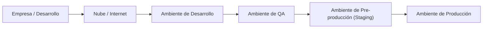

## Introducción: Seguimiento con MySQL

El profesor introdujo la clase indicando que van a analizar **MySQL** y qué cosas se pueden hacer para poder utilizarla. Le interesa que los estudiantes puedan hacer un **seguimiento** del proceso.

> **Profesor:** Pueden ingresar a mysql.com, por favor. Vamos a tratar de hacer la instalación en nuestros ordenadores.

### Del Método Tradicional a la Inteligencia Artificial

Antes, para hacer instalaciones, los estudiantes tenían que recurrir a las **guías, documentación y seguimiento** (el método tradicional).

> **Profesor:** Ahora, miren, vamos a usar justamente los PRs de la inteligencia artificial para ver si nos puede ayudar a hacer esa instalación. ¿Qué es lo más importante para tener un buen prompt? Lo que yo necesito identificar es **en qué equipo** voy a hacer esta instalación.

> [!important] Identificar el sistema operativo antes de descargar
> No es lo mismo instalar MySQL en **Linux**, en **Windows** o en equipos **Mac con iOS**. Varía, y además hay que tener mucho cuidado con el tema del **versionamiento**: hay versiones que van a correr en versiones antiguas de los sistemas operativos, que no son mantenibles y que no van a poder correr en los sistemas operativos que estamos buscando. Si vas a utilizar iOS, entonces hay que buscar el instalador de iOS.

### Uso de Inteligencia Artificial para la Instalación

El profesor demostró el uso de una herramienta de IA orientada al **asesoramiento y acompañamiento**. Escribió un prompt: "paso a paso cómo puedo realizar la instalación de MySQL en Windows".

> **Profesor:** En mi caso, por ejemplo, yo voy a utilizar el tema de hacer la instalación de MySQL sobre mi Windows. Entonces, lo único que yo tengo que pedirle al chat es ayuda para la instalación de MySQL.

#### Discusión sobre Herramientas de IA

> **Estudiante:** ¿Por qué no el Gemini?
> **Estudiante:** Porque es más para desarrollo.
> **Profesor:** Claro, a mí me gusta este porque justamente está más orientado, digamos, al asesoramiento. Es como tu asesor de acompañamiento. Ahora, si quieren pueden utilizar la IA que ustedes gusten.

> **Estudiante:** DeepSeek. Sí, es gratis.
> **Profesor:** Casi todas tienen sus limitaciones. Por ejemplo, ChatGPT: tú puedes generar imágenes, pero no puedes generar 1000 imágenes en un día, solamente puedes generar cuatro imágenes. Después de las cuatro imágenes, puedes hacer varias consultas, pero la generación de código, igual, está limitada en la generación de líneas de código. Imagínate que puedas hacer un programa de más de 10,000 líneas de código: se te consumen tus tokens y ya no vas a tener.

> **Estudiante:** Depende si es por vía API o por suscripción. Hay varias opciones.
> **Estudiante:** ¿Cuál es la mejor?
> **Profesor:** Justamente están punteando, pero igual es con licencias.

> **Estudiante:** ¿Y Gemini es gratis?
> **Profesor:** Claro, con nuestro correo tenemos el acceso.
> **Estudiante:** Porque es de Microsoft, va de Microsoft.
> **Profesor:** Microsoft. Gratis por el correo de la universidad.

---

## Navegación en la Página de MySQL y Descarga

Mientras la IA generaba las instrucciones, el profesor revisó la página de MySQL de manera intuitiva.

> **Profesor:** Mientras va haciendo el tema de las líneas, nosotros revisamos nuestra página. Por instinto, obviamente que yo voy a tener la página y la descripción de los diferentes servicios que tiene. Obviamente que están en inglés. Entonces, por instinto o por deducción lógica, los instaladores deberían de estar en esta sección donde dice **download**.

> [!note] Versión de paga vs. gratuita
> MySQL también tiene una **aplicación de paga** y te dice que puedes probarla de manera gratuita, pero lo que nos interesa es que MySQL tiene una **versión gratuita para el ámbito de la educación**. Si somos de la academia, podemos acceder a MySQL de manera gratuita.

### MySQL Enterprise Edition para Desarrolladores

> **Profesor:** Aquí tienes una opción que dice **MySQL Enterprise Edition para desarrolladores**. Tienes un acceso libre de todos los MySQL Enterprise Edition mientras estés en el proceso de aprendizaje, desarrollo o prototipaje, **no en producción**.

> [!note] ¿Por qué las empresas dan acceso gratuito a la academia?
> Todas las empresas de desarrollo de tecnologías de información y comunicación normalmente dan acceso a las academias con una finalidad: que los estudiantes puedan **retroalimentar a la comunidad** para que se puedan realizar mejoras en las aplicaciones que se están desarrollando. Normalmente en la academia se pueden encontrar **más errores** que en las empresas. En la medida que se vayan encontrando errores y retroalimentando a los proveedores del servicio, se pueden ir beneficiando.

---

## Ambientes de Desarrollo, QA, Pre-producción y Producción

### ¿Qué es Producción?

> **Profesor:** ¿Ustedes han escuchado hablar del término de producción?
> **Estudiante:** Cuando se sube algo al público.
> **Profesor:** Más que público, una versión final. Una versión final podrías no estar en producción.
> **Estudiante:** Un release.
> **Profesor:** Sí, podría ser.

### Diagrama de Ambientes (Explicado en la Pizarra)

El profesor dibujó en la pizarra un diagrama mostrando la empresa desarrollando, conectada a la nube (internet), y los diferentes ambientes:



### Descripción de Cada Ambiente

| Ambiente | Descripción | Quién accede |
| -------- | ----------- | ------------ |
| **Desarrollo** | Donde los desarrolladores trabajan en sus máquinas personales. Se hacen **transacciones ficticias**, no reales. | El desarrollador individual |
| **QA** | Accedido por un **grupo de personas** relacionadas al equipo de QA. | El equipo de QA |
| **Pre-producción (Staging)** | Tiene una **copia real del servidor de producción** con las mismas características (RAM, procesadores, etc.). Se realizan pruebas **casi en tiempo real** y operaciones reales con los clientes finales. | Clientes finales para validación |
| **Producción** | El servidor va a ser accedido por **todos los clientes** dentro y fuera de la organización. Se realizan **transacciones en tiempo real y transacciones reales**. Pueden ser solo clientes dentro de la organización con restricción al público general, pero sigue siendo producción. | Clientes internos y/o externos |

> [!important] Pre-producción replica las características de producción
> El ambiente de pre-producción tiene que tener las **mismas características** que el servidor de producción. Por ejemplo, si tengo 8 GB de RAM (es muy chiquitillo), esos 8 GB de RAM tienen que estar replicados en el ambiente de pre-producción. Si tengo cinco procesadores, esos cinco procesadores tienen que estar replicados. ¿Por qué? Porque en el ambiente de pre-producción se tienen que realizar pruebas casi en tiempo real y operaciones reales con los clientes finales para que ellos vean el funcionamiento de la aplicación y que las transacciones que te han pedido que realice tu sistema sean transparentes y se realicen de manera efectiva. Es por eso que existen estos ambientes.

### Cada Ambiente Tiene Sus Propios Servidores

> **Profesor:** Cada uno de estos ambientes tiene sus propios servidores. MySQL normalmente debería estar instalado en nuestro ambiente de desarrollo. De la misma manera tendría que estar seteado en el ambiente de QA, en el ambiente de pre-producción y en el ambiente de producción. La configuración que nosotros vayamos a realizar en desarrollo, tengo que **tomar apunte** de cada una de las configuraciones que estoy realizando, simplemente por el hecho de que esa configuración tiene que **replicarse en los diferentes ambientes**.

### ¿Cómo Replicar Ambientes?

> **Estudiante:** ¿Se pueden utilizar imágenes de contenización?
> **Profesor:** Puede ser el tema de los famosos **Dockers**. Dockers podría ser una opción, pero no necesariamente es la que vamos a poder visualizarla de manera real. Para nuestro nivel podríamos utilizar las **máquinas virtuales**. ¿Han virtualizado máquinas?
> **Estudiante:** Linux.
> **Profesor:** Linux. Podemos hacer el ejercicio de hacer una máquina virtual de Linux y ver cómo podemos hacer la instalación de MySQL. Vamos a ver que existe **mayor flexibilidad** en la instalación de MySQL con Linux, porque todo se lo puede realizar a través de **líneas de comando**, pero conectados a internet. Se puede hacer eso, no es que no se pueda hacer.

---

## Seguridad en la Instalación de MySQL

> **Estudiante:** Vamos a cambiar y testear la línea de red.
> **Profesor:** ¿Por qué?
> **Estudiante:** Para que sea un poco más seguro. Es que yo al ver de utilizar las configuraciones por defecto, era como que muy inseguro porque la persona puede entrar.
> **Estudiante:** Eso pasó una vez porque no teníamos nada de contraseñas, nada, y era algo conjunto.

> **Profesor:** Has mencionado algo importante ahí. Dentro de lo que vendría a ser la **seguridad de sistemas** existe el tema de la **configuración segura de instalación de aplicaciones**. Como buenas prácticas de desarrollo de software y el tema de mantenimiento de los sistemas, cuando tú estés realizando la instalación de una aplicación, empieces a **cambiar las configuraciones por defecto**, porque cuando instalemos MySQL, por defecto el root va a tener habilitada la conexión remota a tu MySQL. Eso te **viola el tema de la seguridad**.

> [!warning] Cambiar configuraciones por defecto
> - Por defecto, MySQL habilita la **conexión remota** con el usuario **root**.
> - Eso abre vulnerabilidades de seguridad.
> - Se puede y **se debe** cambiar, pero ese tema se ve en la asignatura de **seguridad de sistemas**.
> - Es imprescindible **documentar el proceso de instalación**: registrar el usuario root, su password y todas las configuraciones que se hacen.
> - Si no se documenta, al momento de utilizar la aplicación se van a tener problemas.
> - Lo que se decía: si instalo y públicamente todo el mundo va a poder ver mi IP, van a saber que tengo MySQL y van a intentar conectarse utilizando los **usuarios por defecto**. Eso hay que cuidar.

> [!note] Seguridad de Sistemas como asignatura separada
> **Profesor:** ¿Lo vamos a ver conmigo? No, no deberíamos verlo conmigo. Eso se tendría que ver con la asignatura de **seguridad de sistemas**, porque en seguridad de sistemas lo que tienes que hacer es empezar a documentar y cambiar las configuraciones. Por eso les decía, tenemos que **documentar el proceso de instalación** de nuestro MySQL.

---

## SQLite vs. MySQL

> **Estudiante:** ¿No sería más fácil usar SQLite?
> **Profesor:** SQLite está enfocado al tema de **gestión de datos para dispositivos móviles**. Eso es portable y es chiquitito, es livianito, pero eso **no sirve** para que tú hagas un diseño de base de datos corporativo para un software comercial.

| Característica | SQLite | MySQL |
| -------------- | ------ | ----- |
| **Enfoque** | Dispositivos móviles, transacciones básicas | Bases de datos corporativas, software comercial |
| **Tamaño** | Liviano, portable | Más robusto y escalable |
| **Uso típico** | Chats (imágenes, videos — información irrelevante) | Ventas, contabilidad, gestión completa |
| **Transacciones** | Básicas y sencillas, funcionalidades muy básica | Complejas, múltiples cajeros, monitoreo |
| **Conexiones** | Individual | Múltiples conexiones simultáneas |

> **Profesor:** No sirve para transacciones pequeñitas, o sea, para transacciones y funcionalidades muy básicas, sencillitas, sirve, porque ahí no vas a guardar toda la información, por ejemplo, de ventas, contabilidad. Entonces, el SQLite normalmente lo utilizas para cosas como chats. ¿Qué de importante tienen tus chats? Imágenes, videos. No es importante, es irrelevante, por ejemplo, ese tipo de información.

### Caso de Uso: SQLite como Respaldo Temporal

> **Profesor:** Ahora, en el caso que tú quieras empezar a utilizar, digamos, el tema de la integración de **WhatsApp con aplicaciones comerciales**, ahí ya podemos estar pensando en algo bastante mucho más interesante. Por ejemplo, cuando tú estás realizando una transacción y estás guardando esa información en tu base de datos, puede darse el caso de que **se corte la señal**. ¿Ese registro dónde se perdería? ¿Qué hacemos con ese registro? Lo puedo guardar de manera **temporal en la estructura de SQLite** temporalmente hasta que se restablezca el servicio.
> **Estudiante:** ¿Como respaldo?
> **Profesor:** Como un respaldo. Es un respaldo local, pero solamente te va a servir para transacciones que tú estás realizando. ¿Qué va a pasar cuando tengas, digamos, N cajeros y tengas que hacer una gestión y control de los N cajeros para poder hacer seguimiento y monitoreo de las transacciones que están realizando? Entonces, ahí necesitas una base de datos un poquito más grande y robusta que te permita hacer ese tipo de conexiones. Estamos. Sí, eso es importante.

---

## Proceso de Instalación de MySQL

### Confusión Inicial: MySQL vs. SQL Server de Microsoft

> **Estudiante:** Entregué el MySQL. ¿Cuál? ¿Ya has instalado tan rápido? Ya me cargó los 500.
> **Profesor:** No has descargado el cliente seguro. Installer 8.0.45.
> **Estudiante:** El SQL Manager, el de Microsoft.
> **Profesor:** ¡El de Microsoft!

> [!warning] No confundir MySQL con SQL Server
> Algunos estudiantes descargaron por error el **SQL Server de Microsoft** en lugar de **MySQL de Oracle**. Son productos completamente distintos.

### MySQL Enterprise Edition: Limitaciones

> **Profesor:** Dentro de esto hemos dicho que vamos a ver el tema de MySQL Enterprise Edition for Developers. ¿Por qué? Porque es de acceso gratuito mientras tanto tú estés realizando desarrollo, la academia y además que solamente hagas prototipajes. Tiene el tema de una **limitante en el número de registros** que tú vayas a generar. Si sobrepasas, creo que el **millón de registros**, ya tienes que empezar a pagar licencia. Y al menos si lo vas a utilizar de **manera comercial**, también tienes que pagar licencias. No lo puedes usar de manera libre.

### Versiones Disponibles por Sistema Operativo

| Sistema Operativo | Versiones Disponibles | Notas |
| ----------------- | --------------------- | ----- |
| **Linux** | Tres versiones disponibles | Mayor flexibilidad de instalación |
| **Mac** | Una versión estándar (9.6z) | Solo para Mac versión 15+, **ARM de 64 bits** (para su tipo de procesador) |
| **Windows** | Windows Server 2022, 2019 y Windows 11 | No compatible con versiones anteriores como Windows XP |

> **Estudiante:** ¿Y qué pasa con los que tienen Windows? Intel.
> **Profesor:** Ya. Y para los que tenemos Windows, tenemos este. Esto sirve para estas versiones de Windows. Tengo para Windows Server 2022, 2019 y además tengo el soporte para Windows 11.

> **Estudiante:** Windows XP.
> **Profesor:** No vas a poder instalar en Windows XP esta versión porque te dice que solamente es para Windows 11.

> [!tip] Verificar versión de Windows
> Para saber qué versión de Windows tienes: ve a la parte principal donde dice **Mi PC** → clic derecho → **Propiedades** → **Especificaciones de Windows**. Ahí se muestra la descripción del tipo de sistema operativo que tienes.

> **Estudiante:** ¿Qué Windows tienes?
> **Estudiante:** Windows 11. — Y entonces, ¿por qué me preguntas?
> **Otro Estudiante:** Windows 10 Pro.

> [!note] Compatibilidad con Windows 10
> Aunque la versión más reciente de MySQL Enterprise indica soporte solo para Windows 11, en **Windows 10 igual se puede hacer la instalación sin ningún problema**. La recomendación es tener Windows 11. Si no se tiene, se puede **actualizar** el sistema operativo. También se pueden buscar versiones antiguas para obtener soporte.

### Aceptar Licencia

> **Profesor:** Tiene que aceptar el tema de la licencia de las tecnologías. Agreement: el acuerdo del uso.

### Tipos de Instalación

> **Estudiante:** ¿Qué le pongo? Servidor único, clientes solamente, cliente full o custom.
> **Profesor:** Pon **full** porque vas a tener el servidor y el cliente para hacer conexiones.

### Registro en Oracle

Para descargar MySQL Enterprise Edition es necesario **crear una cuenta en Oracle**. Se puede registrar con el **correo corporativo** o con el **correo personal**.

Datos solicitados en el registro:
- Nombre de pila (primer nombre)
- Apellidos
- Ocupación (estudiante/empresario)
- Teléfono de trabajo
- Empresa: "Universidad Católica Boliviana San Pablo"
- Código postal (4 dígitos para Bolivia)
- Correo electrónico
- Método para la **autenticación multifactor** (correo electrónico)

> [!tip] Gestor de contraseñas
> Es importante crear la cuenta y recordar la contraseña. Se puede usar un **gestor de contraseñas** que te crea automáticamente la contraseña, siempre y cuando la guardes en tu máquina y no te olvides.

### MySQL Community Edition

> **Estudiante:** ¿Y el MySQL Community?
> **Profesor:** El Community es el que es **totalmente gratuito**. También está en la misma página.

> [!note] Diferencia entre Enterprise y Community
> - **Enterprise Edition:** Gratuito para desarrollo y aprendizaje, pero con limitante en el número de registros (~1 millón). No se puede usar de manera comercial sin pagar licencia.
> - **Community Edition:** Totalmente gratuito.

### Problemas de Hardware Durante la Descarga

Varios estudiantes experimentaron problemas durante la descarga:

> **Estudiante:** Vamos a ver si mi HDD de 500 GB aguanta guardarlo.
> **Estudiante:** 500 megas tiene mi gráfica. Si mi gráfica solamente tiene 500 megas, ¿puedo quitarle el sistema operativo entero?
> **Profesor:** Tienes que comprarte uno nuevo. Tu HDD está sufriendo.
> **Estudiante:** Mira, va 46% la descarga y pasé de tener 150 GB libres a 119.
> **Estudiante:** Estás utilizando 100% GPU, 92% memoria, 25% HDD, 100% gráfica.
> **Estudiante:** La gráfica está de vacaciones, no quiere trabajar.

### Máquinas del Laboratorio "Friseadas"

> **Estudiante:** Y si no estábamos en estas máquinas, ¿lo tenemos que volver a instalar?
> **Profesor:** Creo que sí, porque creo que están **friseadas** las máquinas.

> [!note] Máquinas friseadas (congeladas)
> Las máquinas del laboratorio están **friseadas** (congeladas), lo que significa que cualquier instalación o cambio realizado **se pierde al reiniciar** el equipo.

---

## Pasos de Instalación de MySQL (Ejercicio en Clase)

### Descarga

1. **Descargar** el instalador desde mysql.com (el archivo de ~500 MB).
2. Hay dos tipos de instalador disponibles:
   - Uno pequeño (~2 MB) que se conecta al internet y **descarga** todo el software completo.
   - Uno grande (~500 MB) que ya trae todo incluido.

> **Profesor:** El que tenía 500 megas es el que necesitamos. El más pequeñito se va a conectar al internet a descargar.

### Ejecución e Instalación

3. **Ejecutar** el instalador como **administrador** (Windows pide permiso: "Permitir que esta aplicación haga cambios en el dispositivo").

> **Profesor:** Lo que pasa es que muchas veces las aplicaciones te piden permiso de ejecución como administrador. Entonces, es bueno hacer el tema de la instalación como administrador. Si nuestros equipos aquí tienen alguna restricción del uso de la instalación, vamos a tener que pedir que se nos haga la instalación por parte del **departamento técnico**.

> [!tip] Extensiones ejecutables
> El archivo `.exe` es el ejecutable. El `.msi` también es ejecutable. Son los archivos que se deben buscar para iniciar la instalación.

4. Elegir tipo de instalación: **Full** (o **Developer Default**).

> **Profesor:** Ahí tienes: Servidor, cliente, full, custom. Full. Next. Entonces ahí vas a tener el tema del desinstalador, el WorkBench, MySQL Shell para que hagas consultas, Router, documentación y todos los ejemplos.

> **Estudiante:** Todo eso me va a servir?
> **Profesor:** Todo eso te va a servir porque justamente con todo eso vamos a trabajar.

> **Estudiante:** ¿Lo puedo pausar?
> **Profesor:** No vas a pausar nada. Ahorita estás haciendo la instalación. El "para usarlo" lo vamos a ver después.

5. El instalador descarga e instala los componentes: **Server**, **WorkBench**, **Shell**, **Router**, **documentación** y **ejemplos**.

### Configuración del Servidor

6. **Configuración del servidor:**
   - Tipo de conexión: **TCP/IP**
   - Puerto de conexión: **por defecto** (3306)
   - **Password fuerte** para autenticación (¡no olvidarlo!)
   - Nombre del servicio: mantener el valor por defecto
   - **Server File Permissions** (permisos de archivos): **full acceso** por defecto

> **Profesor:** Ese va a ser el nombre del servicio que se va a utilizar para poder conectarse. Tienes que tratar de recordar todas estas configuraciones. Por eso les decía, cuando ustedes están haciendo la instalación y la configuración, tienen que ir **anotando** cada uno de los cambios que están haciendo.

> **Estudiante:** ¿Vamos a cambiar la configuración?
> **Profesor:** No, toda la configuración tiene que ser **por defecto**. No vamos a cambiar nada.
> **Estudiante:** Pero usted nos aconseja que si cambiamos algo, lo anotemos.
> **Profesor:** En la medida que ustedes estén utilizando configuraciones de los servidores y tengan que agregar ciertos niveles de seguridad, entonces ahí se recomienda hacer el cambio de los **puertos de conexión** del servidor de base de datos. Tienes que usar puertos que solamente sean conocidos por tu organización y no sean puertos por defecto, porque si son puertos por defecto en un **escaneo de red**, te pueden identificar.

> **Estudiante:** ¿Server File Permissions?
> **Profesor:** Los permisos que le vamos a dar a los archivos. Sí, garantízale el total acceso, por defecto. Aquí en este caso lo mantenemos porque tú le estás dando los full accesos para que puedan escribir. No necesitas marcar nada adicional. Ahí solamente te está diciendo todas las configuraciones que se van a setear al momento de hacer la instalación.

> [!warning] Contraseñas y configuraciones
> - Se debe setear un **password fuerte** y que no se olvide.
> - Un estudiante puso su contraseña hacía 4 minutos y ya se la había olvidado.
> - Para el ámbito de desarrollo, **no cambiar** las configuraciones por defecto.
> - **No configurar el Router** — no es necesario para nuestro nivel.
> - Anotar todas las configuraciones que se realicen, ya que tendrán que **replicarse** en otros ambientes.
> - Estas configuraciones incluyen lo que se llama **variables de entorno** que hay que considerar al momento de hacer la instalación.

### Instalación en Mac (Línea de Comandos)

> **Estudiante (Cristian, usuario de Mac):** Estoy siguiendo un video de 3 minutos.
> **Profesor:** Cuando estás utilizando Mac, es **mucho más fácil** hacerlo por línea de comando. Paso a paso y te va a lanzar eso de manera rápida. No pierdan mucho tiempo con videos.

### Verificación de Requisitos

> **Estudiante:** Profe, toda esta configuración del servidor, ¿hay que hacerla?
> **Profesor:** Sí, hay que hacer esas configuraciones. Dice: **revisar los requisitos**. Hay que revisar estos requisitos. Y una vez que tengas todo eso, hacer la configuración del server. Posiblemente el instalador revise si tienes los **paquetes necesarios** instalados.

### No Configurar el Router

> **Estudiante:** Estoy en la configuración del router.
> **Profesor:** ¿Para qué router? No necesitas hacer la configuración de ningún router.
> **Estudiante:** Entonces, ¿lo voy a cancelar?
> **Profesor:** Sí, sí, sí. Cancélalo.
> **Estudiante:** Lo que pasa es que si le doy a "next" te permite pasar a next.
> **Profesor:** Ahora te dice "conectar a un server". Usuario root. Ahí sí puedes hacer la verificación (Check). Ahora sí.

### Scripts Ejecutándose

> **Estudiante:** ¿Qué es un script?
> **Profesor:** Script van a ser las **consultas** que tú vas a poder ejecutar.
> **Estudiante:** Ya estoy dentro del servidor, están corriendo los scripts.
> **Profesor:** Están corriendo los scripts, entonces está ejecutando las configuraciones que necesita ejecutarse. Tranquilo, todavía.

### Configuración de Red (Hostname/IP)

> **Estudiante:** Me dice "hostname address".
> **Profesor:** Ahí, por ejemplo, en esas configuraciones, cuando les está hablando de las configuraciones del IP, nombre del equipo, solamente coloquen **`localhost`** porque `localhost` es una **variable reservada** que va a hacer referencia a tu equipo, que ese es el nombre que tiene tu equipo.
> **Estudiante:** ¿Escribo localhost? ¿Mayúscula o minúscula?
> **Profesor:** Minúscula, todo. Pero lee bien las instrucciones. Wizard no es nada malo, es una **ayuda**.

> **Estudiante:** ¿Qué significa Bootstrap?
> **Profesor:** **Bootstrap** es una herramienta bastante interesante para hacer la aplicación **responsive**, o sea, que sea adaptable a los diferentes dispositivos.

### Problemas Comunes Durante la Instalación

- **Espacio en disco:** Algunos estudiantes tuvieron problemas por falta de espacio (HDD saturado al 100%).
- **Uso excesivo de recursos:** GPU al 100%, memoria al 92%.
- **Permisos de administrador:** Los equipos del laboratorio tienen restricciones de instalación.
- **Corte de descarga:** Si se corta, se puede retomar desde donde se quedó.

> **Estudiante:** ¿No era mejor que no descarguen acá porque capaz se corten?
> **Profesor:** No se va a cortar. Imposible. Y además si se llega a cortar, estas aplicaciones tienen una característica: vas a volver otra vez al navegador, le vas a decir restablecer o reiniciar la descarga y hasta donde has llegado, sigue la descarga.
> **Estudiante:** Pero a mí eso pasó una vez que se reinició y...
> **Profesor:** Una cosa es reiniciar el equipo. No tienes que reiniciar el equipo.

- **Confusión entre MySQL y SQL Server:** Algunos estudiantes instalaron SQL Server de Microsoft en lugar de MySQL de Oracle.
- **Confusión con archivos descargados:** Un estudiante descargó ~700 archivos/20 carpetas en lugar del instalador correcto. Tenía conectores de Python, componentes comerciales, etc.

> **Profesor:** ¿Qué has descargado y dónde has descargado? Es que me parece medio raro lo que has descargado. Lo que pasa es que tenías que haber descargado justamente los instaladores. Ahí te dice el procedimiento de cómo puedes hacer la instalación. Te está mostrando todos los productos que tú tienes ahí para poder hacer la instalación: conector, conectores de Python, comercial...

- **Instalador en línea vs. fuera de línea:** El instalador pequeño (~2 MB) se conecta al internet para descargar todo. El instalador grande (~500 MB) ya incluye todo.

> [!tip] Recomendación del profesor
> - Se recomienda que cada estudiante **traiga su propio ordenador** y utilice su MySQL.
> - **No depender** tanto de los laboratorios porque están friseados.
> - Los que no puedan instalar en el laboratorio (por falta de permisos), háganlo en sus máquinas personales.

7. **Finish** para completar la instalación.

---

## Validación de Fuentes de Información

El profesor enfatizó la importancia de **validar las fuentes de información** cuando se usa inteligencia artificial.

> **Profesor:** Señores, se tienen que habituar al tema del manejo de inteligencia artificial para sus tareas cotidianas. El hecho de que antes, por ejemplo, revisábamos el tema de video YouTube, el link, Rincón del Vago, mistareas.com, todo eso ya pasó, ya no tienen que utilizar eso. Traten de utilizar más inteligencia artificial y **validen el tema de las fuentes de información** que están generando.

> [!important] Fuentes válidas de información
> Cuando se genera información con inteligencia artificial, hay que preguntar **cuál es la fuente de verificación de la información** que está generando. Las fuentes válidas deben ser:
> - **Páginas oficiales** (ej: página oficial de Linux, de Oracle para MySQL)
> - **Autores oficiales**
> - **Revistas o artículos de investigación** activos
>
> Si tienes esas fuentes como base, tu información puede ser confiable. Siempre pedir la fuente, porque la fuente te va a decir si es un libro, si el autor es un escritor de artículos de investigación válidos, y si esa información te va a ayudar o no al momento de proponer alguna idea.

> [!tip] Relación con Metodología de Investigación
> En la asignatura de **Metodología de Investigación** se enseña justamente a hacer la validación de las fuentes. Una fuente es quién te está proporcionando la información.
>
> **Profesor:** Si ustedes están generando con inteligencia artificial, por ejemplo, información de cómo pueden hacer la instalación de un sistema operativo, hay que preguntar cuál es la fuente y les tendría que decir la **página oficial de Linux** y la **página oficial de Oracle** para la instalación de MySQL. Eso nos va a permitir justamente validar lo que estamos haciendo. Y lo mismo cuando estén haciendo revisión documental o quieran generar alguna presentación, siempre pidan el tema de la fuente.

---

## Comandos en Terminal

Algunos estudiantes intentaron usar la terminal del laboratorio pero tuvieron problemas.

> **Estudiante:** CD, pero es que el CD no... Quiero ver si C, espacio, mayúscula L, minúscula...
> **Profesor:** No te está autocompletando. Los comandos que estás ejecutando solamente pueden ser comandos limitados.
> **Estudiante:** Igual tuvimos esto en la materia de **Arquitectura de Computadoras** — con Linux y Windows.
> **Profesor:** Sí.

> [!note] Equipos del laboratorio sin autorización
> Los equipos del laboratorio están **friseados** y sin autorización para instalar programas. Están limitados.

---

## Herramientas de Acceso Remoto

El profesor presentó herramientas para que los estudiantes que no traigan sus ordenadores al aula puedan **conectarse remotamente** a sus equipos de casa.

> **Profesor:** Trabajaremos en sus ordenadores, porque si aquí en clase vienen sin sus ordenadores, no van a poder ir avanzando. Lo que me interesa es que puedan ver el paso a paso cómo están ejecutando sus tareas, y es mejor hacerlo en su propio ordenador. Los que no tengan ordenadores físicamente aquí, ¿tienen sus ordenadores en su casa? ¿Tienen internet? Entonces se pueden conectar **remotamente** a sus ordenadores.

### AnyDesk

**AnyDesk** es una aplicación gratuita que permite conectarse remotamente a un equipo desde cualquier parte del mundo.

> **Profesor:** Existen herramientas que nos permiten conectarnos remotamente a nuestros ordenadores. Si tienen ahí sus tareas que están ejecutando, pueden mostrarme remotamente. Entonces, su computadora de su casa puede estar prendida con internet y utilizan este tipo de aplicaciones. Una de esas aplicaciones que se puede utilizar se llama **AnyDesk**. Y AnyDesk nos va a servir para poder conectarnos remotamente **desde cualquier parte del mundo** a tu equipo.

Requisitos:
- La aplicación esté instalada en **ambos equipos** (el local y el remoto).
- El equipo remoto esté **encendido y conectado a internet**.
- Se **acepte la conexión** desde el equipo remoto (alguien debe aceptarla).

> **Profesor:** Aquí, gracias a sus compañeros, pueden utilizarlo. Pero lo malo es que tienes que aceptar de la otra cuenta, de la otra consola.
> **Estudiante:** No es lo malo, es lo bueno.
> **Profesor:** Tienes que llamar a alguien que te lo acepte. Pues por eso, ahí va a estar su mamá, su papá.

> [!note] Verificación en clase
> Dos compañeros probaron exitosamente la conexión con AnyDesk entre sus máquinas. Estaban haciendo un "stream" funcional.
> **Profesor:** ¿Qué herramienta estás utilizando? AnyDesk. Lo han instalado así normal.

> **Estudiante:** ¿Sí o sí tiene que estar conectada al internet?
> **Profesor:** Tiene que estar conectada al internet, pero si no, ¿cómo haces tus tareas sin internet?
> **Estudiante:** ¿Cómo funciona?
> **Profesor:** Funciona con internet. Accedes a la máquina remotamente. Bueno, pues haz la prueba e instálalo.

> **Estudiante:** Esa aplicación tiene que estar aquí en esta máquina también.
> **Profesor:** Sí. Tiene que estar en ambas máquinas. Pero no deja instalar en las máquinas del laboratorio. Ahí vamos a pedir que nos instalen esto.
> **Estudiante:** Eso debe estar tanto aquí como en nuestra PC de escritorio. Y tiene que estar abierto.

### Google Remote Desktop

> **Profesor:** También podemos usar alguna herramienta como **Google** justamente para poder conectarte remotamente a tu equipo. Entonces puedes utilizar Google.

### TeamViewer

> **Profesor:** Después hay otro que se llama **TeamViewer**.
> **Estudiante:** ¿No hay una que sea página web así, sin descargar nada?
> **Profesor:** Es que necesitas instalar. Mira, **TeamViewer Remote Control App**. Con Google inclusive puedes controlar tus celulares con esto, **cualquier sistema operativo**, porque lo puedes descargar como una aplicación de móvil.

> **Profesor:** Ahora, imagina: te olvidas tu computadora en el examen. Te puedes conectar **desde tu celular** y puedes trabajar desde tu celular.

> **Estudiante:** Allá tienen que estar instalados los dos.
> **Profesor:** Tendría que estar instalado los dos, pero si no me equivoco, TeamViewer tiene una **versión gratis**.
> **Estudiante:** ¿Esto igual se puede usar como para hacer trabajos en conjunto?
> **Profesor:** Creo que sí.

> **Profesor:** Y una vez que tienes esto, puedes conectarte a partir de aquí de esta sesión.

> [!important] No hay excusa para no tener acceso al ordenador
> Los que vengan sin ordenador al aula no tienen excusa para no conectarse a sus ordenadores de casa. Existen herramientas como **AnyDesk**, **TeamViewer** y **Google Remote Desktop** que permiten conexión remota.

### Tangente: Baterías de Laptops

> **Estudiante:** La batería, ¿dónde está? En mi casa.
> **Estudiante:** ¿Y por qué no te la pusiste? No sirve, para qué, pesa.
> **Estudiante:** ¿Y cómo puedo sacar la mía?
> **Estudiante:** ¿Por qué quieres sacarla?
> **Estudiante:** Porque se ve mejor así, creo.
> **Profesor:** Es fácil de sacarla. Abajo, abajo. Si tienes dos cositas allí atrás en la parte de atrás, dale la vuelta. Ahí puedes sacarla.
> **Estudiante:** Ah, no tiene. Tenés que destornillar.

> [!note] Estudiantes y sus equipos
> Una estudiante mencionó que su laptop consume 80 grados de temperatura. Otro estudiante tuvo que cambiar las teclas de lugar de su laptop porque no tenía algunas. Otro estudiante describió su laptop como "un Frankenstein".

---

## MySQL vs. SQL Server

> **Estudiante:** Yo en mi casa puedo ir a trabajar con el SQL Server que tengo.
> **Profesor:** A ver, ¿SQL Server o MySQL?
> **Estudiante:** MySQL, que se puede hacer consulta, crear todas las...
> **Profesor:** A ver, a ver, tenemos que diferenciar entre MySQL y SQL Server.

> [!important] Diferencia entre MySQL y SQL Server
> - **MySQL** es de **Oracle**.
> - **SQL Server** es de **Microsoft**.
> - Son **dos gestores de bases de datos totalmente distintos**, dos tecnologías totalmente distintas.
> - Con la **sintaxis de consultas**, inclusive. Las consultas en la base de datos varían. El tema SQL ahí puede variar un poquito.
> - Las variaciones no son tan significativas, pero sí vas a tener algunas directamente.

> **Estudiante:** Les muestro que el código que mostró anteriormente en clase, ¿lo reconoce?
> **Profesor:** Está bien, entonces lo puedes usar. Pero hay que tener mucho cuidado. Sí, claro, ya yo voy viendo si realmente lo que estamos avanzando coincide o no. Si hay algo que no agarra, está recto.

> [!note] Comunicación entre MySQL y SQL Server / Access
> **Estudiante:** Vamos a enviar el link de Access a SQL para que se conecte.
> **Profesor:** No son bases de datos que se comunican. No son compatibles. Para nada, son dos tecnologías totalmente diferentes.
>
> Ahora, lo que sí se puede hacer es justamente para que se puedan comunicar, utilizar algunos **middleware** para que se puedan comunicar. Se pueden **instalar o desarrollar**. Es como unos **puentes** que enlazan un servidor con otro.

---

## Uso de MySQL WorkBench

### ¿Qué es WorkBench?

**MySQL WorkBench** es la **interfaz gráfica de administración** de la base de datos MySQL. Es la herramienta que el profesor quiere que los estudiantes tengan instalada.

> **Profesor:** El que me interesa que ustedes puedan ver es este, el **WorkBench**. Esa herramienta es la que me interesa que ustedes la tengan instalada.

> [!note] Terminal vs. WorkBench
> Si al abrir MySQL solo aparece una terminal (CMD/Shell), significa que **solo se instaló el servidor** pero no el WorkBench. Se necesita instalar también la **interfaz gráfica** (WorkBench) para tener la pantalla de administración visual.
>
> **Profesor:** ¿Por qué le parece una terminal así? Porque no has instalado el WorkBench. Solamente esa es la conexión al servidor. Tienes que instalar la interfaz, la pantalla, la **interfaz gráfica de administración** de la base de datos.

### Conexión Inicial

Una vez instalado MySQL WorkBench:

1. **Seleccionar la conexión** con `localhost`.
2. Ingresar el **password** configurado durante la instalación.
3. Se puede marcar **"Save password"** para no tener que ingresarlo cada vez (se guarda en una "billetera" / keychain).

> **Estudiante:** Save password, o sea, ¿es para que no lo escribas todas las veces?
> **Profesor:** Es una billetera.
> **Estudiante:** ¡Me entró!
> **Profesor:** Ya lo tienen, ya lo tienen por ahí. Ya estamos.

> **Profesor:** El mismo procedimiento se hace, pero cuando tienes tema de un servidor externo, en vez de colocar `localhost`, colocas la **IP del servidor**. Ahora sí es lo mismo: una conexión, una base de datos.

### Verificar que la Configuración Esté Correcta

> **Estudiante:** Quiero saber si está bien configurado esto.
> **Profesor:** Pero está bien. Una vez que logras abrir WorkBench y conectarte, ya no tienes que tocar nada más de configuración. Estamos bien.

> **Estudiante:** Quiero poner en modo oscuro ahora. Muy blanco.
> **Profesor:** ¿Cómo que blanco no te gusta?
> **Estudiante:** No, no me gusta que sea blanco.

### La Interfaz es Similar a Access

> **Profesor:** Ya tienen el entorno donde se puede hacer el tema de la configuración de sus bases de datos. La interfaz debería resultar ser tan intuitiva como ustedes han estado utilizando como primera etapa en **Access**. ¿Se acuerdan cómo hacían el tema de la creación de una base de datos en Access? Entonces inspeccionemos nuestra interfaz de administración de base de datos y veamos si es tan intuitivo como para que nosotros podamos relacionarnos.

---

## Creación de una Base de Datos

### Qué Hacer Después de la Instalación

> **Profesor:** Una vez que ya tengan ustedes su MySQL instalado, ¿qué tendríamos que hacer?
> **Estudiante:** Una base de datos.
> **Profesor:** La creación de una base de datos. Pero esta vez la creación de la base de datos tendría que ser la creación de la **base de datos del proyecto**, las primeras tablas. Tu primera tabla puede ser la tabla número uno. Es por eso que se les había pedido que para el tema de su proyecto ustedes hagan una pequeña **recopilación de información**. Es entender la **lógica del negocio** que ustedes van a poder analizar. Si no entienden su lógica de su negocio o del proyecto que quieren hacer, es muy difícil que vayan a diseñar una base de datos, sacar las entidades y todo lo que va a participar en la base de datos.
> **Estudiante:** Pero eso, ¿no lo pudiéramos deducir nosotros mismos?
> **Profesor:** No creo.
> **Estudiante:** No nos tiene fe.
> **Profesor:** No es que no tenga fe, pero nunca han escuchado...

### Método 1: Mediante la Interfaz Gráfica (WorkBench)

> **Profesor:** Creemos una base de datos. Todavía no estamos hablando de código, primero estamos utilizando el tema de la interfaz visual.

1. En el **panel izquierdo** del navegador, buscar la sección de **esquemas** (schemas).
2. **Crear un nuevo esquema** (buscar la opción "nuevo esquema").
3. Colocar el **nombre de la base de datos** del proyecto.

> **Estudiante:** Si yo estoy hablando de bases de datos, en inglés sería "database". Entonces, ¿ahí tienen un "database"?
> **Profesor:** Ya lo selecciono. "Conectar una base de datos", "Manejar conexión", "Conectar de dato".
> **Profesor:** No, no, no. Ahorita estás conectado a la base de datos **por defecto** de MySQL y es un esquema que tú has creado al momento de hacer la instalación.  Entonces, ¿cuál sería el procedimiento para crearnos una base de datos?
> **Estudiante:** Lo desinstalo y vuelvo a instalar MySQL.
> **Profesor:** (risas)

> **Profesor:** Ya, en el **panel izquierdo** del navegador debería decir sobre los esquemas, **crear un nuevo esquema**.

4. **Guardar** el esquema.

> **Estudiante:** ¿Cuál es el nombre de este proyecto? ¿Binario dicen?
> **Estudiante:** No, es latín.
> **Estudiante:** Oye, pero si **cafetería** es el nombre del proyecto.
> **Profesor:** Entonces, ahí puedes crear el nombre.

> **Estudiante:** Tiene que ser lo más intuitivo posible.

#### Rename de Esquemas

> **Estudiante:** ¿Puedo cambiar el nombre después?
> **Profesor:** Una vez que hayas guardado, sobre el esquema, dale clic derecho y verifica si puedes hacer un **rename**. Si se puede hacer, entonces es fácil. Pero eso normalmente **no se hace**, porque al final cuando tú defines el nombre del esquema se va a utilizar.
> **Estudiante:** ¿Y entonces no le pongo nombre ahorita, cuando lo tenga?
> **Profesor:** Es para hacer tu ejercicio. Después puedes crear una nueva, ¿no? Claro que sí. Prueba uno. Experimento.

### Tipos de Datos y Consistencia

> **Estudiante:** Digamos que nuestra tabla no coincida, si mis tipos de datos no coinciden con mi caso de uso.
> **Profesor:** Obviamente que se va a romper, o sea, no vas a poder hacer el tema de codificación para guardar los datos de los campos correctamente. Si tú defines un campo de un tipo y al momento de hacer la prueba utilizas un **string**, al momento de hacer la verificación te va a detectar el error. Por eso es importante que al momento de definir tus campos lo hagas **claramente**. Hay un montón de cosas que hay que tener en cuenta. Ya, haz la prueba. Haz la prueba de guardarlo.

### Método 2: Mediante Consola (Línea de Comandos)

> **Profesor:** Ahora, la segunda opción para poder hacer la creación de sus bases de datos es a través de la **terminal**. ¿Y cómo se haría? ¿Cuál sería el comando para poder hacer la creación de base de datos?
> **Estudiante:** Create, obviamente.
> **Profesor:** Entonces, como estamos relacionados con el tema del inglés, va a ser `CREATE`, ¿qué?
> **Estudiante:** Table.
> **Estudiante:** Table.
> **Profesor:** Table. Estoy hablando de **base de datos**.
> **Estudiante:** Database.
> **Profesor:** Entonces estaría siendo `CREATE DATABASE` y el nombre de la base de datos.

> **Estudiante:** ¿Insertar datos con INSERT?
> **Profesor:** No, no, no, estoy hablando todavía del INSERT todavía. Eso después vamos a ver. Pero lo que estoy viendo es primero la **creación** de nuestra base de datos.

```sql
CREATE DATABASE universidad_db;
```

### Convención de Nombres: Terminación `_db`

> [!important] Estándar de nombres para bases de datos
> Cada base de datos tiene que tener ciertas características para mantener cierto estándar, y son sus **terminaciones**. Se puede colocar el nombre de la base de datos y una terminación para poder identificar qué tipo de objeto se está creando:
> - Ejemplo: `universidad_db`
> - El sufijo `_db` es el que va a permitir hacer consultas a nivel de las bases de datos o identificarlas.
> - Los estudiantes que ya crearon sus bases de datos **sin** el underscore y el `_db` deben tratar de **modificar y corregir** eso. Es importante hacer eso.

### Crear Base de Datos desde Consola

> **Profesor:** Ahora tratemos de hacer la creación de otra base de datos con el tema de `CREATE DATABASE`, el nombre de la base de datos con su extensión `_db`, pero **desde consola**. ¿Cómo se hace eso? Tienes unas consolas.
> **Estudiante:** ¿Cuál consola? Tengo dos consolas.
> **Profesor:** ¿Cuáles?
> **Estudiante:** Una que está aquí que dice... y otra que me dice "program".
> **Profesor:** Hagan la prueba.
> **Estudiante:** ¿Qué dijo? Creación de una base de datos desde consola, supongo. ¡No me grites!
> **Estudiante:** Vamos. ¡Está gritando!
> **Estudiante:** Es mi forma de hablar. Es mi tono de voz.
> **Estudiante:** Está pidiendo a Jemy que actúe como psicólogo.

> [!note] Problemas con la consola
> Un estudiante intentó ejecutar comandos en la terminal (CMD) pero no visualizaba los resultados. El profesor sugirió que podría ser un problema de **variables de entorno** en la terminal.

---

## Relación entre Asignaturas

> [!note] Asignaturas relacionadas con Bases de Datos 1
> - **Bases de Datos 1 (SIS-122):** Lo que se lleva en el semestre actual — diseño de base de datos, consultas, generación de reportes. Todo lo que se va a llevar en el semestre deberían dominarlo bien.
> - **Bases de Datos 2:** Toda esta información se debería llevar a lo que es **Data** y **Data Analytics**.
> - **Seguridad de Sistemas:** Configuración segura de instalaciones, cambio de puertos, protección de accesos.
> - **Metodología de Investigación:** Validación de fuentes de información.
> - **Arquitectura de Computadoras:** Uso de línea de comandos en Linux y Windows.
> - Cursos de formación en general (ej: **Python**) sirven para poder avanzar.

---

## Indicaciones Logísticas

### Sobre los Equipos

> [!warning] Traer ordenadores personales a clase
> - Se recomienda que cada estudiante **traiga su propio ordenador** y que utilice su MySQL instalado.
> - No depender tanto de los laboratorios de la universidad.
> - El profesor solicitará al director que hagan la instalación de MySQL en **este laboratorio y el otro** (laboratorio 2). El laboratorio 2 tiene MySQL en el ordenador del docente pero no en las máquinas de estudiantes.
> - Los equipos del laboratorio están **"friseados"** (congelados): cualquier instalación se pierde al reiniciar.
> - Algunos estudiantes no van a poder instalar en el laboratorio porque los ordenadores **no tienen permisos especiales**.

### Sobre las Evaluaciones

> **Estudiante:** ¿El examen va a ser en grupo?
> **Profesor:** No, **individual**.
> **Estudiante:** ¿Hay que traer los computadores?
> **Profesor:** Sí, hay que traer los computadores. Pero de todas maneras, igual al director le voy a pedir que nos hagan la instalación de MySQL en este laboratorio y en el otro.

> [!warning] Disciplina en clase
> **Profesor:** Deja de seguir jugando y te voy a sacar del curso. A los que jueguen en clase los voy a sacar y no los voy a permitir.

### Sobre las Diapositivas

> **Profesor:** Les he pasado al grupo la presentación, las diapositivas. Por favor, **revisen las diapositivas** que les he pasado, porque en base a eso también va a haber preguntas.

> **Estudiante:** Profe, hay que leer su diapositiva.
> **Profesor:** Claro, porque eso es supuestamente lo que hemos estado haciendo.

### Lo Más Importante de Esta Etapa

> **Profesor:** Lo más importante en esta etapa es que ustedes logren hacer el tema de la **instalación** de sus bases de datos. ¿Han logrado avanzar? Han hecho una instalación bastante sencilla. No es compleja. El momento de crear una base de datos tampoco es complejo, porque tenemos el tema de las interfaces.

### Horario de la Clase

Se generó confusión sobre el horario de la clase:

> **Estudiante:** Hasta las 7 de la noche tenemos que tener.
> **Estudiante:** Son siete... 7 menos 50...
> **Estudiante:** Es hasta las 7.
> **Estudiante:** 7 - 10 que es igual 7 punto. Es el día más largo.
> **Profesor:** Hasta las 7:20 vamos a estar.

> **Estudiante:** A mí, discúlpenme, a los que se van en bus, pero se van a ir a las 7. 7:15 tengo. O sea, a las 7 puntos ya debo estar afuera.

> **Estudiante:** Según yo es hasta las 6:15.
> **Estudiante:** Bueno, sí, 6:30, pero si nos vamos hasta las 7...
> **Estudiante:** Si nos brindan más horas para aprender...
> **Estudiante:** Pero yo también te juro que pensaba que era hasta las 6.
> **Estudiante:** Aquí está, aquí está el horario.
> **Estudiante:** Yo me quedo hasta las 8 si me dicen.
> **Estudiante:** 6 y 10, horario.
> **Estudiante:** Ay, que sí, tienes razón. Hasta las 6:10.
> **Estudiante:** Ya digo, bro. Nos quedamos de más.

> **Profesor:** Claro, porque hasta las 7 terminamos de hacer estas configuraciones básicas. Ya nos quedaremos entonces hasta las 7.
> **Estudiante:** Quiere aprender a actualizar su Windows.

---

## Asistencia

El profesor tomó lista al final de la clase:

- **Marcos Armés** — presente
- **Ricardo Valderas** — presente ("no tengo nada que hacer")
- **Ernesto Castedo** — presente
- **José Luis Castro** — presente
- **Leonardo** — presente ("no, este año no" — refiriéndose a otra pregunta)
- **Antonio Elías** — ==ausente==
- **Christopher García** — presente
- **Emanuel Justiniano** — presente
- **André** — presente
- **Kevin** — presente
- **Pablo Poper** — presente ("Pablo Enrique")
- **Agustín Subieta** — presente
- **César Zambrana** — presente

> **Profesor:** Ya se pueden ir. Por favor, revisen las diapositivas que les he pasado porque en base a eso también van a haber preguntas. Dos horazos.