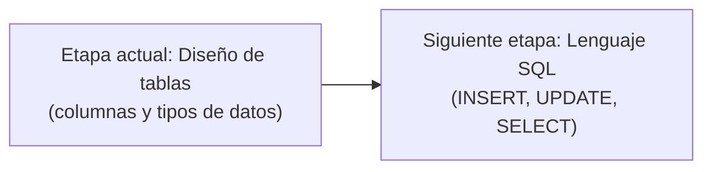

## Introducción: De la Instalación al Diseño

La clase comenzó con una pequeña dinámica entre estudiantes — uno le pidió el celular a otro, y el profesor intervino con humor:

> **Estudiante:** Usted le pidió celular.
> **Profesor:** No, yo no le he pedido celular. Mira, regalo nuevo. Está bien.
> **Estudiante:** ¡Cinco puntos, profe!

El profesor retomó el hilo indicando que, una vez completada la instalación de **MySQL**, ya se puede empezar a generar y crear los primeros diseños de bases de datos. Recalcó que el proceso de instalación y la lógica de configuración es la misma independientemente del manejador de base de datos que se utilice — si en el futuro se migra a otro gestor, el paso a paso y la importancia de guardar las configuraciones se mantiene igual.

> **Profesor:** MySQL justamente nos va a ayudar a nosotros a tener una mejor visibilidad de cómo nosotros podemos hacer nuestros primeros diseños de nuestras bases de datos. Ahora de aquí nosotros podríamos saltar a otro tipo de manejador de base de datos y podemos saltar a cualquier otro tipo de manejador de datos. La lógica va a ser la misma.

> [!important] Guardar siempre las configuraciones de instalación
> Si no se guardan las configuraciones realizadas durante la instalación, probablemente se van a tener muchos problemas más adelante. Esto aplica a cualquier manejador de base de datos.

---

## Diseño de la Base de Datos: Pensar en el Proyecto

### El Punto de Partida: Entender la Lógica del Negocio

Para poder diseñar una base de datos, primero hay que **pensar en el proyecto**. El profesor explicó que se necesita alguna herramienta que permita hacer un buen diseño. En la asignatura de **Metodología de la Investigación** se ven instrumentos para recopilar datos; uno de ellos es la **encuesta**, que puede tener preguntas abiertas o cerradas.

> **Profesor:** Lo que nosotros tenemos que hacer es ponernos a pensar en nuestro proyecto porque ya vamos a empezar a diseñar nuestras bases de datos. Para poder pensar en nuestro proyecto, nosotros tendríamos que estar utilizando algún tipo de herramienta que nos permita justamente hacer un buen diseño de una base de datos.

### Caso Práctico: Proyecto "Banco"

El profesor preguntó a los grupos qué proyecto van a hacer. Hubo confusión — varios grupos no tenían claro su proyecto todavía:

> **Profesor:** ¿Qué proyecto? ¿Saben del proyecto?
> **Estudiante:** El proyecto.
> **Otro estudiante:** No saben qué proyecto hacer. Tiene que concentrarse. Vamos a hacer censo.

> [!warning] Manejar las definiciones de los términos
> El profesor advirtió: "Que no sepa manejar las definiciones de los términos que esté manejando, están fregados." Es fundamental entender qué significa cada concepto antes de empezar a diseñar.

El primer grupo presentó su proyecto: un **banco**. El profesor tomó ese caso para demostrar cómo se hace el proceso de recopilación de información.

> **Profesor:** Los del banco, ¿qué información van a pedir para que ustedes hagan su diseño de base de datos? El banco tiene muchos sistemas. Dentro de los sistemas de los bancos, ¿qué van a pedir? Ya, ahora se congelaron.
> **Estudiante:** Una encuesta.
> **Profesor:** Claro, pues hemos dicho que vamos a hacer una encuesta para el banco, pero en el banco, ¿qué información vamos a pedir para poder armar la encuesta? ¿Qué me interesa?

#### Datos Generales del Banco (Ejemplo de Encuesta)

El profesor fue guiando a los estudiantes para identificar qué datos básicos se necesitan para crear un banco en la base de datos. Hubo una respuesta que generó humor:

> **Estudiante:** Género.
> **Profesor:** Oye, estoy hablando del banco. El banco no tiene género.

Los datos que sí corresponden:

- **Nombre** del banco
- **Nombre del representante legal**
- **Dirección** (de la central)
- **Número de registro de funcionamiento**

> **Profesor:** Cuando yo estoy armando mi encuesta, tengo que pedir esta información porque esta es la información básica que yo necesito para el banco, para crear un banco. Estos van a ser mis **datos generales del banco**.

> [!note] De la encuesta a la tabla
> Lo que se trabaja en la encuesta va a servir para identificar, por ejemplo, el **nombre** del campo y su **tipo de dato**. Es el primer paso para diseñar las columnas de las tablas.

---

## Tipos de Datos y Atributos

### Tipos de Datos Conocidos

El profesor preguntó qué tipos de datos conocen los estudiantes, recordando que ya han llevado programación:

> **Profesor:** ¿Qué tipo de datos ustedes conocen? Ah, han llevado programación.
> **Estudiante:** Cadena, varchar.
> **Profesor:** Cadena, varchar. Hay una diferencia entre lo que es un `varchar`, una cadena, un `string`. Hay diferencias, ¿no? ¿Cuáles son esas diferencias entre ese tipo de datos? La diferencia va a estar en función a su **tamaño**.

### Validación del Tamaño

El profesor explicó que al definir un campo, hay que preguntarse cuál va a ser el **tamaño máximo** de ese campo. Ejemplo con el nombre del banco:

> **Profesor:** ¿Cuál es el tamaño máximo de un nombre de un banco? ¿Cuántos caracteres tendrá? Puede ser que sea 50 caracteres, pero tengo que validarlo. Aquí voy a colocar 50 caracteres como máximo. Entonces, podría estar pensando en un `varchar` probablemente.

> [!important] Definir el tipo de atributo correctamente
> Al crear columnas en una tabla, hay que validar el **tipo de atributo** y sus **características** (tamaño, restricciones, etc.). En MySQL WorkBench, el `varchar` tiene por defecto 45 caracteres, pero ese valor **se puede modificar** al tamaño que se considere pertinente.

### Terminología: Tuplas y Atributos

> **Estudiante:** Duplas.
> **Profesor:** Tuplas, ¿no? Atributo. Tengo que validar el tipo de atributo que va a ser.

---

## MySQL WorkBench: Práctica en Clase

### Conexión al Servidor

> [!warning] Confusión frecuente: número de servidor
> Algunos estudiantes reportaron que MySQL les pedía un "número de servidor". El profesor aclaró que eso no debería ocurrir con MySQL — si aparece esa pantalla, probablemente están intentando conectarse a **SQL Server** (de Microsoft) en lugar de **MySQL** (de Oracle). Son productos completamente distintos.

> **Estudiante:** Está pidiendo número de servidor para entrar.
> **Profesor:** No debería pedirles número del servidor. ¿De dónde está? ¿Qué van a ser? ¿Estás utilizando SQL Server? ¿Qué han dicho que utilizan? SQL Server ya no vamos a ver ese. MySQL, MySQL. Tienes que conectarte a MySQL.
> **Profesor:** No pues, ya qué pena que no vayan a clase. O sea, tampoco puedo hacer mucho.

### Crear un Esquema (Base de Datos)

El profesor demostró cómo crear un esquema en MySQL WorkBench:

1. En el **panel izquierdo** del navegador, ir a la sección de **esquemas**.
2. Crear un **nuevo esquema** con el nombre del proyecto.
3. Guardar el esquema.

> **Profesor:** No tienes que crearte un esquema nuevo de manera innecesaria. Tienes que trabajar en un esquema nuevo que se llame con el nombre de tu proyecto. Tienes que fijarte dónde están tus esquemas.

Hubo un estudiante que estaba creando un esquema llamado "experimento" en lugar de usar el esquema de su proyecto:

> **Profesor:** ¿Por qué estás haciendo un esquema "experimento"? Ahorita para este caso estamos yendo para un esquema del proyecto. O sea, no tienes que crearte un esquema nuevo innecesario. Crea un esquema nuevo con el nombre correcto. Tienes que trabajar en un esquema nuevo que se llame con el nombre de tu proyecto.

### Crear Tablas y Definir Columnas

Una vez creado el esquema, el siguiente paso es crear **tablas** y definir sus **columnas** (atributos):

> **Profesor:** Miren lo que pasa: aquí, por ejemplo, en esta columna que estoy colocando — "datos del banco" — hay un **tipo de dato**. En este tipo de dato es donde ustedes van a definir el tema del tamaño del tipo de dato. Aquí está por defecto el `varchar(45)`. Ese `varchar` se puede modificar y se puede colocar el tamaño que ustedes consideren de manera pertinente.

Hubo estudiantes con problemas para escribir en las columnas y otros que guardaban automáticamente sin querer:

> **Estudiante:** ¿Cómo que no me deja escribir ahí en la columna?
> **Profesor:** Ahí, el nombre de la tabla se llama "dat..." Porque tengo doble... se guardó automáticamente.

También hubo problemas con esquemas faltantes:

> **Estudiante:** No tiene los esquemas. Era un esquema normal. Pensaba que yo lo había creado.
> **Profesor:** Estamos. Compremos con otro. Está intentando entrar. Ahora muy lento, no creo.

Varios estudiantes tuvieron que reinstalar MySQL durante la clase:

> **Estudiante:** Yo tuve que desinstalar todo. 5 minutos. Y se llama ese es el que trabaja y puedes hacer un montón de cosas.
> **Estudiante:** Ya estamos. Finish. Ya estás.
> **Estudiante:** Ya está. Hay una galleta super rica. Mi mamá...

> [!note] Contexto de la práctica
> La clase fue mayormente práctica y caótica — estudiantes con diferentes problemas de instalación, esquemas que no aparecían, columnas que no dejaban escribir. El profesor fue atendiendo caso por caso mientras otros avanzaban.

### Copiar Código de Esquema

Al final de la clase, el profesor dio una indicación sobre cómo copiar la configuración de un esquema a otro:

> **Profesor:** Te tienes que copiar toda la esquina que contiene ese código. Ese mismo código te lo copias y lo pegas para la otra.
> **Estudiante:** Oye, tiene que traer su paste de verdad.
> **Estudiante:** Oye, sin hacer modificaciones, ¿no?

> [!tip] Ejercicio de la clase anterior (Access → MySQL)
> El ejercicio que los estudiantes hicieron con **Access** debería repetirse en MySQL: crear un esquema (base de datos), y dentro de esa base de datos crear tablas, definiendo para cada tabla los tipos de datos de cada columna (atributo). Es exactamente el mismo procedimiento, en una herramienta diferente.

---

## Etapas del Desarrollo: ¿Qué Estamos Viendo Ahora?

El profesor fue muy explícito sobre en qué etapa del proceso se encuentran:

> **Profesor:** Ahorita, por ejemplo, este proceso pequeñito que ustedes están haciendo, deberían haber hecho la anterior clase porque hemos hecho la instalación y ya deberían tener eso funcionando. El ejercicio que ustedes han hecho con Access, lo mismo deberían repetir y hacer el mismo procedimiento con esto: crear un esquema que es crear una base de datos y dentro de esa base de datos crear tablas. Y para cada una de las tablas que han creado comenzar a definir cada uno de los tipos de datos. Solamente es crear tablas y crear el tema de las columnas que estamos utilizando, los atributos. Solamente puros atributos que estamos definiendo.

> **Profesor:** El tema de realizar el tema de los `INSERT`, el tema de la inserción de datos a nuestras tablas, todavía no lo estamos viendo. Solamente lo que estamos viendo es el tema de **diseño de las tablas** nada más. Una vez que estén bien diseñadas las tablas, nosotros ya podemos empezar a pasar al siguiente etapa.

> [!important] Secuencia de aprendizaje
> 1. **Ahora:** Diseño de tablas — definir columnas y tipos de datos (sin insertar datos todavía).
> 2. **Siguiente etapa:** Empezar a ver todo lo relacionado con el lenguaje SQL para inserción, modificación y actualización de datos en las tablas.

---

## Uso de Inteligencia Artificial para el Proyecto

El profesor recomendó activamente el uso de IA para avanzar con el proyecto:

> **Profesor:** El hecho de que ustedes no sepan qué tablas van a utilizar en un gimnasio me parecería demasiado ilógico a la altura que ustedes están manejando, por ejemplo, inteligencia artificial. ¿Qué haría? Yo me crearía un prompt para agarrar y decir: "quiero un proyecto de base de datos para hacer finanzas, por ejemplo. ¿Qué tablas yo debería crear?" Ese prompt debería generar automáticamente todas las tablas que tú necesitas.

### Dos Formas de Usar la IA

| Uso | Prompt sugerido | Resultado |
| --- | --------------- | --------- |
| **Identificar tablas** | "Quiero un proyecto de base de datos para [tema]. ¿Qué tablas debería crear?" | Lista de tablas con sus propósitos |
| **Generar script SQL** | "Generame un SQL para MySQL para la creación de todas estas tablas" | Script listo para ejecutar en WorkBench |

> [!tip] Para los que están repitiendo la materia
> Los estudiantes que ya cursaron Bases de Datos 1 pueden ir más lejos: pedirle a la IA que genere los **diagramas de entidades y relaciones** (ER) de sus tablas, aunque ese tema todavía no se ha visto formalmente en clase para los que la llevan por primera vez.

> **Profesor:** En esta etapa todavía no estamos viendo el tema de la creación de esquemas con SQL. Si ustedes quieren adelantarse, le dicen al prompt: "Chat, generame un SQL para MySQL para la creación de todas estas tablas" y te va a generar un script para que te cree todas las tablas y no tengas nada que hacer.

---

## Problemas de Instalación: Configuración Inicial

Varios estudiantes tuvieron problemas con la instalación de MySQL. El profesor explicó la causa más común:

> **Estudiante:** Yo creo que sí instalé todo igual a instalarlo.
> **Profesor:** Lo que pasa contigo es que cuando haces la instalación tal cual, la primera instalación que te deja es una **configuración inicial**. Lo que estás haciendo es modificar esa configuración inicial, y esa modificación te está restringiendo hacer ciertas modificaciones.

> [!warning] No modificar la configuración inicial de MySQL
> - Hacer la instalación sin tocar nada.
> - Solo crear un **nuevo esquema** (base de datos).
> - **No eliminar** ninguno de los esquemas existentes — no se ha pedido eliminar nada.
> - Toda la configuración inicial debe quedar intacta.

> **Profesor:** Logra hacer la instalación, no toques nada. Solamente haz el tema de la creación de un nuevo esquema. No elimines nada porque no se ha pedido que se elimine nada de los esquemas. Toda tu configuración perfecta tiene que estar.

Otro estudiante comentó que había borrado todo y reinstalado:

> **Estudiante:** Yo lo borré el otro día, desinstalé todo y p*** madre.
> **Estudiante:** Y cómo hago eso para que cuando se le horrible tenía aquí todo. ¿Qué hago?
> **Estudiante:** 15 minutos más por culpa.

---

## Indicaciones para la Próxima Clase

> [!todo] Para la siguiente clase
> - **Traer el proyecto definido.** No se acepta venir sin saber qué proyecto van a hacer.
> - Indicar cuántas tablas va a tener el proyecto (no importa si no están todas definidas todavía, pero hay que tener una estimación).
> - Saber cómo se va a **relacionar** la información entre las tablas.
> - Los que aún tienen problemas con la instalación: resolverlos antes de la próxima clase.

> **Profesor:** No quiero que vengan la siguiente clase y me cuenten y me digan que no saben qué proyecto van a hacer. Quiero que a la siguiente clase me vengan y me digan: "Oye, voy a hacer el tema de un gimnasio." Señores, el hecho de que ustedes no sepan qué tablas van a utilizar en un gimnasio me parecería demasiado ilógico. La siguiente clase lo que yo necesito es que ustedes ya me vengan con la idea de su proyecto. Esa idea de proyecto me tiene que decir: "voy a crear 50 tablas." No me interesa qué tan bien definidas están las tablas todavía, pero necesito saber cuántas tablas. Las tablas van a ser donde yo voy a empezar a guardar información y cómo voy a relacionar esa información.

---

## Asistencia

El profesor tomó lista al final de la clase. No se registraron nombres específicos en esta sesión.

> **Profesor:** Por favor, para la siguiente clase ya vengan con su proyecto. Chao.
