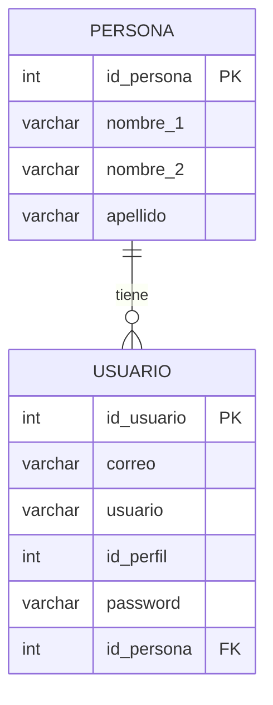

## Avance de Proyectos: Encuestas, Entidades y Formularios

### El Rol de la Encuesta en el Diseño de Bases de Datos

La clase inició con el profesor atendiendo consultas sobre el avance de los proyectos grupales. Varios estudiantes estaban confundidos sobre qué se les había pedido como entregable. El profesor reiteró el proceso que deben seguir:

> **Estudiante:** Oiga, pero ¿qué es lo que nos está pidiendo? ¿La captura del...?
> **Profesor:** ¿Qué captura? ¿Has venido a clase?
> **Estudiante:** No, no me acuerdo.

El profesor explicó que el primer paso es realizar una **encuesta** al cliente o usuario del sistema que van a desarrollar. A partir de los resultados de esa encuesta, se identifican las **entidades** (tablas) necesarias para la base de datos.

> **Profesor:** Tienes que hacer una pequeña encuesta a tu cliente. Una vez que haces esa encuesta, lo que vas a hacer es empezar a identificar las entidades. ¿Qué es una entidad? Una tabla.

> [!important] Proceso de identificación de tablas
> 1. Realizar una **encuesta** al cliente o usuario del sistema
> 2. Analizar los resultados para **identificar entidades** (tablas)
> 3. Determinar qué **datos** necesita cada tabla
> 4. Diseñar las tablas con sus atributos y tipos de dato

El profesor autorizó el uso de **inteligencia artificial** para apoyar este proceso: una vez que se tiene la base de la encuesta, se puede pedir a la IA que identifique las entidades necesarias y genere el listado de tablas.

> **Profesor:** Yo no veo ningún problema que utilicen inteligencia artificial para que hagan el tema de las encuestas. Además, una vez que tienes la base de la encuesta, tú puedes pedir que te haga la identificación de las entidades que vas a necesitar diseñar en una base de datos y te va a generar el listado de cuántas tablas necesitas.

### Los Formularios como Fuente de Diseño

El profesor introdujo un concepto clave: al diseñar tablas, hay que basarse en los **formularios** que ya utilizan las organizaciones. Un formulario permite visualizar qué datos e información necesita la organización almacenar.

> **Profesor:** Nosotros no nos inventamos el tema de las tablas, tiene que salir de algún lado. Salen de los formularios que utilizan las organizaciones.

> [!example] Ejemplo: Encuesta para gimnasio
> Si el proyecto es un sistema para un gimnasio, la encuesta debería preguntar:
> - ¿Tiene formulario de registro de clientes? → Adjunte una copia
> - ¿Qué plan va a tener el cliente? ¿Plan mensual, trimestral?
> - ¿Qué datos registra al momento de la inscripción?
>
> Los gimnasios modernos incluso manejan **reconocimiento facial**: registran al cliente una sola vez, le colocan fecha de entrada y salida, y ya no necesitan registro manual cada vez.

### Ejemplos de Proyectos en Clase

El profesor fue atendiendo a diferentes grupos según su proyecto:

**Sistema inmobiliario:**

> **Estudiante:** Venta de inmuebles, ¿no?
> **Profesor:** Ya, perfecto. Entonces, colocas primero: "sistema inmobiliario."

La IA ya les estaba ayudando a identificar entidades: propietario, propiedades, contrato, cliente. El profesor resaltó que aunque la IA genera esto automáticamente, hay que **entender los conceptos** de relaciones y entidades para poder trabajar con esos resultados.

**Sistema de seguimiento de estudiantes** — un estudiante había hecho una encuesta sobre el impacto de la deserción estudiantil, pero el profesor le corrigió el enfoque:

> **Profesor:** Lo que tú has hecho es una propuesta de un estudio del impacto que puede tener la deserción estudiantil, pero eso no me sirve para un sistema. ¿Qué sistema quieres hacer? Si quieres hacer un sistema de control de seguimiento de estudiantes, tu formulario tiene que ser distinto: ¿qué elementos son importantes para hacer seguimiento? Edad, situación, nivel de formación, ingresos, carrera, materias que está tomando. Entonces ya estás armando diferentes entidades.

> [!tip] Recomendación: Usar IA para generar encuestas
> Cuando ya se tiene clara la idea del sistema, se puede usar un prompt como: *"Necesito ayuda para generar requerimientos para un sistema de [tema]. ¿Cuáles son las entidades, tablas y formularios que necesito?"* La IA genera la estructura base y luego se ajusta según la retroalimentación del cliente.

**Sistema de seguimiento de gastos:**

> **Profesor:** Sí sirve, porque de igual manera si vas a hacer un tema de seguimiento de gastos, necesitas un usuario, un perfil, y necesitas el tema de identificación de entradas y salidas. Puedes hacerlo, pero tienes que entender su diseño.

---

## Tipos de Sistemas

Un estudiante preguntó qué tipo de sistema está construyendo, y el profesor aprovechó para explicar la importancia de esta clasificación:

> **Estudiante:** ¿Qué tipo de sistema estoy construyendo?
> **Profesor:** Esa es una de las mejores preguntas. Ya han llevado la asignatura de introducción a lo que es ingenierías, teoría general de sistemas, definición de sistemas.

El profesor enumeró los diferentes tipos de sistemas que existen:

- **Sistema de información geográfica**
- **Sistema de información catastral**
- **Sistema de información administrativa**
- **Sistema de información gerencial**

> [!important] Identificar el tipo de sistema
> Es fundamental saber qué tipo de sistema se está desarrollando antes de empezar a diseñar las tablas. La clasificación del sistema determina el enfoque del diseño de la base de datos.

### Ejemplo Práctico: La Tiendita de la Esquina

El profesor ilustró todo el proceso de análisis con un ejemplo concreto:

> **Profesor:** Yo quiero hacer un sistema para el control de las ventas de la tiendita de la esquina. ¿Qué tendría que pedirle a la señora?

El proceso de levantamiento de requerimientos sería:

1. **Pregunta:** ¿Cuál es su proceso? → *"Cada mañana me levanto y hago un pedido de pan."*
2. **Pregunta:** ¿Cómo registra su pedido? → *"Tengo que ir al mercado y digo cuántos panes quiero. Manual. Tengo mi libretita."*
3. → Le sacas una foto a esa libretita → **Módulo 1: Pedidos/Adquisición de productos**
4. **Pregunta:** ¿Cómo lo comercializa? → *"Vienen mis clientes y les vendo."*
5. → **Módulo 2: Ventas/Distribución de producto**
6. **Pregunta:** ¿Usted factura? → *"Sí, facturo."*
7. → **Módulo 3:** La venta tiene relación con **facturas**

> [!note] Flujo de análisis de requerimientos
> Este análisis paso a paso —preguntando al cliente sobre sus procesos reales, identificando formularios y registros manuales existentes— es lo que genera las **entidades** y **relaciones** del sistema.

---

## ¿Por Qué Usar una Base de Datos?

El profesor lanzó la pregunta a toda la clase y fue construyendo la respuesta con las contribuciones de los estudiantes:

> **Profesor:** ¿Por qué tengo que usar una base de datos? ¿Por qué es importante el uso de la base de datos?

> **Estudiante:** Es la forma más segura de guardar datos.
> **Profesor:** Segura. ¿Este curso ha llevado ciberseguridad? No, todavía no. Les voy a dar un cursito de ciberseguridad.

> **Estudiante:** Es más útil que tener cosas en un papel.

> **Estudiante:** Es más eficiente.
> **Profesor:** Eficiente también. ¿En qué sentido eficiente?
> **Estudiante:** En que puedas encontrar los datos de manera más rápida, con consultas.
> **Profesor:** Con consultas. Y no tengo que estar buscando de manera manual en mi cuadernito.

> **Estudiante:** Va a estar organizada, va a tener una lógica.

### Razones para Usar una Base de Datos

| Razón | Descripción |
| ----- | ----------- |
| **Seguridad** | Control de acceso con usuarios y passwords (ejemplo: `root` en MySQL) |
| **Eficiencia** | Consultas rápidas vs. búsqueda manual en cuadernos |
| **Organización** | Estructura lógica y sistematizada de la información |
| **Evitar redundancia** | Eliminar datos duplicados e información innecesaria |
| **Reducir errores humanos** | Evitar registrar "Jimena con G" y "Jimena con X" como personas distintas |
| **Generación de reportes** | Tiempo reducido drásticamente comparado con el registro manual |
| **Toma de decisiones** | Datos centralizados permiten análisis y decisiones informadas |
| **Centralización** | Un solo servidor, una sola base de datos para toda la organización |

> [!example] Error humano: El caso de Jimena
> **Profesor:** ¿Cuántas veces registraré el nombre de mis clientes innecesariamente? Y en un momento dado hasta me voy a equivocar al momento de registrar al cliente. Jimena con G, Jimena con X. Listo, se puede dar. Y les estoy registrando varias veces con ese error.

### Centralización de la Información

El profesor profundizó en por qué es vital centralizar la información:

> **Profesor:** ¿Sería correcto tener varias bases de datos de estudiantes aquí en el curso? No debería. Probablemente yo necesito un servidor y una sola base de datos. Voy a centralizar la información de todos mis estudiantes. A diferencia de tener cada equipo con su propia base de datos — ahí voy a consumir recursos, memoria, y muchos otros elementos tecnológicos innecesarios.

### Bases de Datos Distribuidas

Esto llevó al concepto de **bases de datos distribuidas**:

> **Profesor:** Significa que el modelito de tablas que ustedes están haciendo las voy a poder replicar en otras ciudades, en otras ubicaciones. Pero va a ser lo mismo: cuando yo hago una transacción en tu base de datos, se va a replicar esa misma transacción en todas las bases de datos similares.

El profesor explicó dos enfoques de distribución:

1. **Replicación completa:** La misma base de datos se replica en varias ubicaciones
2. **Particionamiento:** Una tabla en una ubicación, otra tabla en otra ubicación — se divide la información

> [!warning] Riesgo del particionamiento
> Si una unidad se apaga, no se puede resguardar información en esa base de datos. El particionamiento tiene más riesgo que la replicación completa.

### Seguridad: Backups y Copias de Seguridad

> **Profesor:** En base de datos, el concepto de seguridad se puede dividir en muchas dimensiones, pero básicamente la literatura tradicional lo maneja desde el punto de vista de los **backups**.

> [!important] Ejercicio futuro: Backup y Restauración
> Cuando los estudiantes tengan sus bases de datos bien diseñadas, el profesor realizará un ejercicio práctico:
> 1. Sacar un **backup** de la base de datos
> 2. Hacer un **drop all** (eliminar toda la base de datos)
> 3. **Restaurar** la base de datos usando el backup
>
> Si se logra hacer este ejercicio correctamente, ya se está avanzando significativamente. Si hay dificultad, es un problema procedimental que se verá en clase.

### Eficiencia y Normalización

> **Profesor:** Cuando estoy hablando de la eficiencia, voy a optimizar, voy a reducir la cantidad de información que estoy generando. Esto lo voy a lograr a través de la **normalización** de mis tablas.

---

## El Modelo Relacional

### Origen e Historia

El profesor contextualizó históricamente el modelo relacional:

> **Profesor:** Es un concepto que se crea desde los años... considero que inclusive mucho antes del año 69. Estamos hablando del año 45, cuando ya se tenían los primeros ordenadores y justamente estos permitían hacer el tema del almacenamiento de la información.

### Concepto

Los **modelos relacionales** permiten organizar la información mediante **tablas bidimensionales** y relacionar cada una de las tablas entre sí. Las relaciones posibles entre tablas son:

| Tipo de Relación | Descripción |
| ---------------- | ----------- |
| **1 a 1** | Una entidad se relaciona con exactamente una de otra |
| **1 a N** | Una entidad se relaciona con muchas de otra |
| **N a 1** | Muchas entidades se relacionan con una de otra |
| **N a N** | Muchas entidades se relacionan con muchas de otra |

> [!important] Diagrama Entidad-Relación
> A partir de la identificación de relaciones entre tablas, se construye el **diagrama entidad-relación (ER)**. Este diagrama se realiza con SQL en MySQL WorkBench.

---

## Diseño de Tabla: Ejemplo Práctico con "Usuario"

### Definición de Atributos

El profesor construyó en vivo el diseño de una tabla `usuario` preguntando a los estudiantes qué atributos debería tener:

| Atributo | Tipo de Dato | Características |
| -------- | ------------ | --------------- |
| `id_usuario` | `INT` | Único, auto-incrementable |
| `correo` | `VARCHAR(45)` | Cadena de caracteres |
| `usuario` (nickname) | `VARCHAR` | Cadena de caracteres |
| `id_perfil` | `INT` | Entero, referencia a tabla de perfiles |
| `password` | — | *Requiere cifrado* (ver sección siguiente) |
| `id_persona` | `INT` / `VARCHAR` | **Llave foránea** hacia tabla `persona` |

> [!note] Sobre el tipo VARCHAR
> `VARCHAR` significa **variable de caracteres**. Se define el tamaño máximo de caracteres que va a utilizar (ejemplo: 45, 50, 100, 120). Para determinar el tamaño correcto, hay que investigar cuál es el tamaño máximo real del dato — por ejemplo, el nombre más largo de una persona. Hay que **basarse en una regla**, no inventar valores.

> **Estudiante:** ¿Un usuario tiene nacionalidad?
> **Profesor:** Un usuario tiene nacionalidad. Seguro. Pero no necesitas nombre aquí — esa entidad de usuario la vas a relacionar con otra tabla.

---

## Cifrado vs. Encriptación

### El Problema del Password en Texto Plano

Al llegar al atributo `password`, el profesor planteó un problema de seguridad:

> **Profesor:** Si coloco el password como `STRING`, cuando esté haciendo el registro se va a guardar así: "123". ¿Será correcto? Porque si alguien entra a mi base de datos y ve el password, va a poder leerla.

### Algoritmos de Cifrado en Base de Datos

El profesor listó los algoritmos principales:

- **MD5** — Función resumen (antiguo, considerado *inseguro* hoy en día)
- **SHA-256** — Función resumen
- **SHA-512** — Función resumen
- **AES-256** — Algoritmo de cifrado

### Diferencia entre Cifrado y Encriptación

El profesor dedicó tiempo a diferenciar estos dos conceptos, que suelen confundirse:

| Concepto | Descripción | Dirección | Longitud del resultado |
| -------- | ----------- | --------- | ---------------------- |
| **Encriptación** | Ocultar la información con el **mismo número de caracteres** que el texto original | Doble sentido (encriptar y desencriptar) | Igual al original |
| **Cifrado** (hashing) | Aplicar una **función resumen** que genera un código de longitud fija, sin importar el tamaño del texto original | Un solo sentido | Siempre la misma (ej: 32, 64 caracteres) |

> **Profesor:** Si yo encripto "hola" (4 caracteres), el resultado tendrá 4 caracteres pero con caracteres distintos. Eso es encriptar: ocultar la información con el mismo tamaño.

> **Profesor:** Pero si yo cifro "hola" con MD5, el resultado va a ser, digamos, 64 caracteres. Y si cifro "papá", el resultado también va a ser 64 caracteres. Para un texto grande o para un texto pequeño, el resultado siempre va a ser el mismo número de caracteres. Eso se llama **cifrar**: aplicar una función resumen.

> [!important] Características clave
> - **Cifrado (hashing):** Un solo sentido. No se puede "descifrar" fácilmente. El resultado siempre tiene la misma longitud fija.
> - **Encriptación:** Doble sentido. Se puede encriptar y desencriptar. El resultado mantiene la longitud del original.

> [!example] Algoritmo del César (Encriptación clásica)
> Un ejemplo clásico de **encriptación** es el cifrado de **Julio César**: se sustituye cada letra por otra desplazada un número fijo de posiciones. El resultado tiene el mismo número de caracteres que el texto original.

### Ejercicio en Clase: MD5 en Línea

El profesor pidió a los estudiantes que buscaran en internet un cifrador MD5 en línea y probaran con diferentes textos:

> **Profesor:** Busquen en internet "cifrar con MD5 en línea". Coloquen "hola", coloquen una frase, y van a ver que los resultados les van a lanzar el mismo número de caracteres.

### Digresión: La Máquina Enigma

La discusión sobre cifrado llevó a un estudiante a mencionar la historia de **Enigma**:

> **Estudiante:** Los ingleses supuestamente hicieron la primera computadora del mundo y la usaron para descifrar mensajes. Captaban por radio la señal de los nazis, que enviaban mensajes encriptados. Los ingleses querían descifrar esos mensajes y construyeron una máquina para hacerlo.
> **Profesor:** Así se llama la película. Creo que sí la vi.

> [!note] Referencia cultural
> La película *"The Imitation Game"* (2014) narra la historia de **Alan Turing** y el equipo de Bletchley Park que construyó la máquina para descifrar los mensajes codificados con la máquina **Enigma** durante la Segunda Guerra Mundial. Este es un ejemplo histórico real de la batalla entre encriptación y criptoanálisis.

### Unicidad: Ejemplo de Placas de Automóvil

Durante la discusión sobre datos únicos, surgió el tema de las placas vehiculares:

> **Estudiante:** Una placa de automóvil es única. ¿Es en teoría, no?
> **Profesor:** No es en teoría, es la realidad. Es único. No puede haber repetidos. Si hay repetidos significa que es **chuto** o **clonado**.

> **Estudiante:** ¿Y cuál es la diferencia entre chuto y clonado?
> **Profesor:** **Chuto** no tiene documentos legales. **Clonado** tiene documentos legales, pero está utilizando su placa de manera indebida — es el mismo modelo del auto, color, pero no es el mismo chasis ni el mismo motor. Externamente es lo mismo.

---

## Relaciones entre Tablas: Usuario ↔ Persona

### El Problema de Relacionar dos Tablas

El profesor planteó cómo relacionar la tabla `usuario` con una nueva tabla `persona`:

**Tabla `persona`:**

| Atributo | Tipo de Dato |
| -------- | ------------ |
| `id_persona` | `INT` / `VARCHAR` (ej: carnet de identidad) |
| `nombre_1` | `VARCHAR` |
| `nombre_2` | `VARCHAR` |
| `apellido` | `VARCHAR` |

> **Profesor:** ¿Cómo puedo tener esta tabla de usuario y relacionarla con esta tabla persona?
> **Estudiante:** Por el correo.
> **Profesor:** Oye, aquí no veo ningún correo. ¿Cómo la persona se relaciona con el usuario?

### Cardinalidad de la Relación

El profesor exploró la cardinalidad con un ejemplo práctico:

> **Profesor:** Una persona tiene N usuarios, ¿por qué no? ¿Cuántas cuentas de Facebook tienes?
> **Estudiante:** Una.
> **Profesor:** Mentiroso.

La conclusión fue: una persona puede tener **un correo único** por cuenta, por lo tanto la relación puede ser de **1 a 1** (un usuario = una persona) o de **1 a N** (una persona puede tener múltiples usuarios con correos distintos).

### La Llave Foránea

La solución es agregar el atributo `id_persona` dentro de la tabla `usuario`. Este atributo es una **llave foránea** ([foreign key](https://dev.mysql.com/doc/refman/8.0/en/create-table-foreign-keys.html)) que referencia la tabla `persona`:

> **Profesor:** Cuando tú crees un usuario, vas a tener tu ID usuario único. Vas a tener tu correo, tu nickname, un perfil, un password, y un `id_persona`. Este `id_persona` tiene que ser igual al de la tabla persona. ¿Para qué? Para que cuando yo haga una consulta y diga "quiero saber cómo se llama el usuario número uno", busco el `id_persona` de ese usuario, voy a la tabla persona, y puedo extraer el nombre, apellido y los demás datos.

> [!important] Los IDs y la Unicidad
> Los IDs permiten identificar que los registros no se repitan varias veces. El `id_usuario` es la **llave primaria** de la tabla usuario, y el `id_persona` es una **llave foránea** que conecta con la tabla persona.

---

## Normalización: Introducción Intuitiva

El profesor explicó que lo que los estudiantes están haciendo de manera natural —separar datos en tablas distintas en lugar de poner todo en una sola tabla gigante— es, en esencia, el proceso de **normalización**:

> **Profesor:** Básicamente, de manera intuitiva lo que estamos haciendo es la normalización hasta una tercera forma. De momento nadie está haciendo una sola tabla única con todos los N campos —que se ve en la vida real, sí se ve— pero intuitivamente no estamos haciendo eso. Estamos empezando a identificar las entidades de nuestra organización, de nuestro sistema, y estamos empezando a diseñarlas para nuestra base de datos.

> [!note] Sobre la normalización
> La **normalización** es el proceso de organizar los datos en una base de datos para reducir la redundancia y mejorar la integridad. Se trabaja en "formas normales" progresivas (1FN, 2FN, 3FN). Aunque aún no se ha visto formalmente en clase, los estudiantes ya están aplicando los principios intuitivamente al separar datos en tablas distintas.

---

## Indicaciones y Entregables

### Para Esta Clase

> [!todo] Entregables inmediatos
> - **Subir al Drive** todo el trabajo realizado hasta el momento:
>   - La encuesta (formulario de Google Forms)
>   - Las tablas diseñadas (antiguas y nuevas)
>   - Las relaciones entre tablas con los campos definidos
> - Si trabajan en **grupo**, ambos miembros deben demostrar que están trabajando. Uno sube el documento y el otro coloca un **link de referencia** al mismo.

> **Profesor:** Si son grupo, necesito que me demuestren que están trabajando los dos. Porque si tu compañero es el único que está haciendo las tablas y los diseños, y tú no estás haciendo nada, eso yo me voy a dar cuenta cuando estén exponiendo.

El profesor también indicó que va a crear **carpetas adicionales** en la plataforma para que los estudiantes suban los exámenes que se van a tener, además de los formularios, tablas y relaciones.

> **Profesor:** Ya les voy a crear otras carpetas para que ustedes suban ya los exámenes que vamos a tener. Formularios, tablas, las relaciones de sus tablitas con los campos.

### Para la Siguiente Clase

> [!warning] Exposiciones
> A partir de la siguiente clase, los estudiantes van a empezar a **exponer sus tablas** — la primera etapa de las tablas. Todavía no se está viendo el tema de relaciones de tabla ni normalización formal, solamente el diseño de tablas con datos brutos.

### Revisión Individual de Proyectos

Durante los últimos minutos, el profesor fue revisando brevemente los proyectos individuales de algunos estudiantes:

- Un estudiante estaba trabajando en un **sistema para un taller mecánico**. El profesor le indicó que un mecánico puede trabajar en varias obras, y que hay que considerar los **estados** del proceso (terminado, revisando, iniciando).
- Otro estudiante tenía dudas sobre cómo separar las tablas de `usuario` y `user_login`.
- Un estudiante preguntó si se pueden usar **funciones matemáticas** para descifrar (por ejemplo, multiplicar un número), a lo que el profesor respondió que el MD5 siempre genera la misma cantidad de caracteres (64 caracteres), independientemente del input.

### Etapa Actual del Proyecto

El profesor fue muy claro sobre en qué fase se encuentran:

- ✅ **Diseño de tablas** — atributos, tipos de dato
- ✅ **Llaves foráneas** — agregar el componente de relación entre tablas
- ❌ **Relaciones formales** — todavía no
- ❌ **Normalización formal** — todavía no
- ❌ **Consultas SQL (INSERT, SELECT, etc.)** — todavía no

---

## Incidente: Vulnerabilidad en los Trabajos Compartidos

Un grupo de estudiantes descubrió que podían acceder y modificar los trabajos de otros compañeros en la plataforma compartida:

> **Estudiante:** Encontramos una vulnerabilidad.
> **Estudiante:** No pues, no me pagan. Si un payaso acá me pone a borrar, puedo borrar o manipular.

El profesor advirtió severamente sobre las consecuencias:

> **Profesor:** Jóvenes, van a tener mucho cuidado con el tema de las tablas. Si van a querer jugar con el tema de eliminar o hacer daño a su compañero, se van a meter en problemas bastante serios, inclusive va a ser con la exclusión de la universidad.

> **Estudiante:** Pero tienen registro.
> **Profesor:** Claro, hay registro. Hay historial de cambios. La persona afectada puede venir a reclamar, veo el historial de cambios, y chao.

Un estudiante confundió la plataforma con **OneDrive**, pero el profesor aclaró que no están usando OneDrive:

> **Estudiante:** ¿OneDrive?
> **Profesor:** ¿Qué OneDrive? No hay OneDrive.

> [!warning] Respeto por el trabajo ajeno
> La plataforma de trabajo compartido (Workspace) tiene **historial de cambios**. Cualquier manipulación o eliminación del trabajo de un compañero es rastreable y puede resultar en sanciones graves, incluyendo la exclusión de la universidad.

---

## Asistencia

El profesor tomó lista al final de la clase. Estudiantes presentes mencionados:

- Marcos Arnés
- Ricardo Valderas
- Ricardo Alejandro Carvajal
- Ernesto Castedo
- José Luis Castro
- Leonardo Rahí Franco
- Antonio Elías
- Christopher García
- Emanuel Justiniano
- Enrique Molina
- Yasit Band
- Kevin Panoso
- Said Pérez
- Enrique Pope
- Jorge Rivero
- Agustín Subieta
- Sebastián Zambrana

Belén **no asistió** a esta clase.

Durante la lista, el profesor hizo un comentario personal a un estudiante sobre su apariencia:

> **Profesor:** No está bien. Hazte cortar otra vez. No entiendo por qué se hacen crecer el cabello.

Sebastián Zambrana comentó que ya tenía las tablas listas y pidió unos segundos para subir la encuesta, las tablas antiguas y las nuevas:

> **Sebastián:** Dame dos segunditos, porfa. Subo la encuesta, las tablas antiguas que hice y las tablas nuevas.

El profesor también recordó que las tablas que están subiendo son **solamente el modelo de tabla**, sin llenar datos de usuarios ni nada todavía.

> **Profesor:** Las tablas, solamente es el modelo de tabla, no llenar ningún usuario ni nada. Todavía.

> **Profesor:** Listo. Cuídense. Buen fin de semana.
