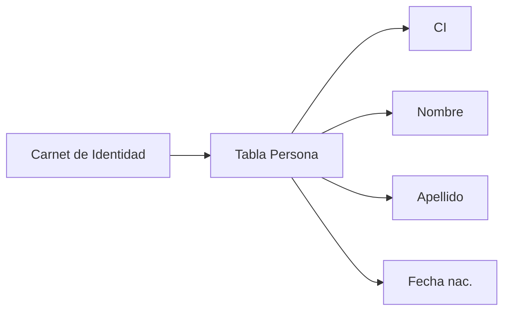
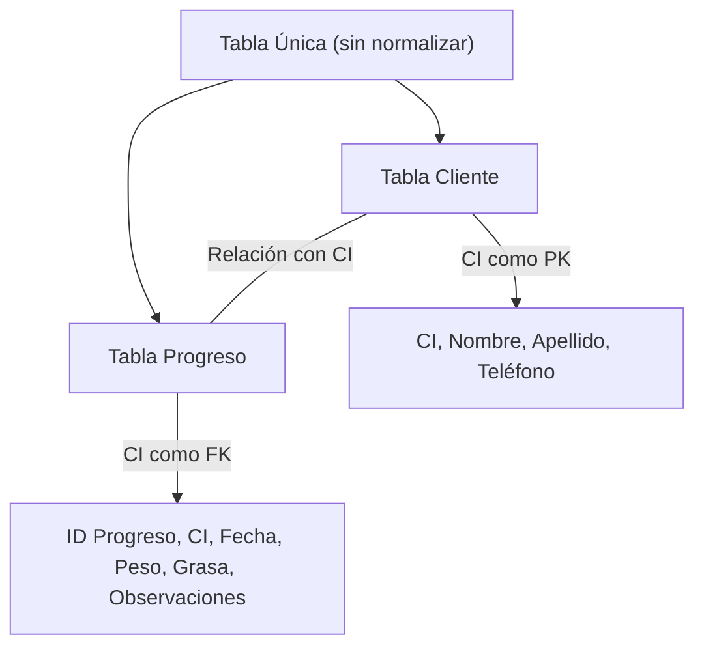

## Revisión de Avances de Proyectos

La clase inició con la toma de asistencia y la revisión de los avances de cada grupo en el Drive. El profesor recordó la importancia de la asistencia:

> **Profesor:** Si no tiene el 80% de asistencia, no se aprueba.

El profesor fue llamando a cada estudiante para verificar el estado de sus entregables: encuestas, tablas y diagramas.

### Validación del Diseño de Tablas

El profesor enfatizó que los diseños de tablas presentados por los estudiantes deben tener un **respaldo metodológico**. No es suficiente diseñar tablas basándose únicamente en la experiencia personal o la intuición.

> **Profesor:** Lo que pasa de que para que ustedes puedan tener una validez de las tablas que ustedes están identificando y que están diseñando, yo necesito que ustedes me digan, por ejemplo, en base a una encuesta realizada a este cliente, a esta empresa, a esta institución, he logrado identificar que puedo tener estas entidades o estas tablas. Pero no me pueden decir, y no es que esté mal, pero no es correcto, que me digan que "según mi experiencia creo que puedo tener estas tablas."

> [!important] Fuentes válidas para diseñar tablas
> 1. **Encuestas** realizadas al cliente o usuario del sistema
> 2. **Formularios** existentes de la organización — a partir de su estructura se deducen las tablas
> 3. **Bibliografía** especializada en la temática del sistema

Un estudiante mencionó que había diseñado tablas para un sistema de créditos basándose en su experiencia laboral en una empresa. El profesor le indicó que, como alternativa a la encuesta, podía presentar la **estructura de los formularios** que usaba esa empresa y extraer las tablas a partir de esa documentación.

> **Profesor:** Si tienes acceso a los formularios, los formularios son la base. En base a los formularios es que tú tienes que extraer estas tablas.

### Observaciones a Proyectos Individuales

El profesor revisó varios proyectos y realizó observaciones específicas:

- **Cafetería (Arnés/Marcos):** Tenía encuestas, tablas y resultados para un sistema de cafetería. El profesor lo revisó y pasó al siguiente.

- **Sistema de créditos (Carvajal):** Había diseñado tablas de clientes, proyectos, ventas, diseño de ventas, créditos, cortas y pago. El estudiante justificó el diseño diciendo que había trabajado en una empresa que daba créditos y usaba formularios. El profesor le indicó que necesitaba encuestas o formularios formales como respaldo (ver sección de validación).

- **Ernesto Castedo:** Era su **primera clase** del semestre. El profesor le pidió que se pusiera al día.

- **Leonardo:** Su carpeta en el Drive estaba **vacía**. El profesor le señaló que no había subido nada.

- **Antonio / Christopher García:** El profesor revisó su proyecto pero aún no habían enviado nada. El equipo dijo que "ahorita se lo va a enviar."

- **Proyecto de Emanuel:** El diseño de tablas se veía bien visualmente, pero faltaba justificación. El profesor preguntó de dónde salió el diseño de tablas.

> **Profesor:** ¿De dónde sacas ese diseño de tablas?
> **Estudiante:** De la encuesta.
> **Profesor:** ¿Y dónde están las encuestas? Suban.

- **Banco (Andrey Ovando):** Tenía encuestas y tablas presentadas. El profesor hizo una observación sobre los **nombres de los campos**: uno de los campos se llamaba `MNT`, lo cual no era descriptivo.

> **Profesor:** El nombre tendría que ser lo más descriptivo posible, o al menos en la descripción del campo tú me coloques qué significa. Si colocas "inter transferencia" es el máximo que puedo transferir, el mínimo debería ser lo mismo. Los campos tienen que ser, si bien pueden ser cortitos, lo más claro posible. En la descripción de los campos podríamos colocar ese tema de la especificación de qué significa.

- **Encuestas y resultados:** El profesor revisó el trabajo de un estudiante que tenía resultados de encuestas con 20 encuestados, pero solo mostraba las posibles respuestas sin la estructura de las preguntas. El profesor le pidió que mostrara una **captura de pantalla** de cómo queda el formulario en Google Forms.

> **Profesor:** Solamente son las posibles respuestas que te dieron tus 20 encuestados. No está mal, está bien, es bastante interesante lo que has hecho, pero yo necesito ver el tema de las preguntas, la estructura de las preguntas: cómo las has hecho, preguntas abiertas, cerradas, cómo la estás orientando.

  El estudiante estaba trabajando con un compañero (Juan Luis). El profesor verificó que ambos integrantes estuvieran contribuyendo al trabajo.

> [!warning] Entregables en el Drive
> - Todos los integrantes del grupo deben figurar como **autores** en los documentos
> - Tanto el diagrama como el documento de formularios deben llevar los nombres de los integrantes
> - Si trabajan en grupo, ambos deben demostrar trabajo activo

---

## Recopilación de Información para Diseño de Base de Datos

El profesor usó el caso del proyecto de **gimnasio** para explicar conceptos clave de diseño de tablas, a partir de las observaciones generales del avance de los estudiantes.

### Identificar Campos a Partir de Documentos Reales

> **Profesor:** Cuando nosotros quisiéramos hacer el diseño de base de datos, lo primero que tengo que preguntarme es, por ejemplo, ¿qué información debería tener un usuario en mi base de datos? Para poder recopilar esa información, ¿qué instrumento podría utilizar?

El primer instrumento es la **observación**. Por ejemplo, para una tabla de **persona**, se puede observar la información contenida en un **carnet de identidad**: nombre, apellido, fecha de nacimiento, número de CI. Esos son los campos iniciales de la tabla.

### Relación Persona ↔ Usuario de Sistema

No todas las personas registradas en el sistema van a ser usuarios activos del mismo. Se puede tener millones de personas, pero solo un subconjunto tendrá acceso al sistema.

> **Profesor:** Puedo tener millones de personas, pero de todos los millones de personas probablemente 10 van a tener acceso al sistema. Entonces, puedo tener una tablita de usuarios de sistema, que solamente voy a relacionarlo con persona en función a lo que yo vaya a registrar.

El flujo de registro sería:
1. Se busca a la persona por su **carnet de identidad**
2. Los campos de la tabla persona se **auto-completan**
3. Se agrega información adicional del perfil de usuario (tipo de acceso, permisos, etc.)

---

## Análisis del Proyecto del Gimnasio: Llaves Primarias e Identificadores

### El Problema de la Tabla "Progreso"

El profesor se interesó particularmente en la tabla de **progreso** del proyecto del gimnasio. Un estudiante (Fernando/Agustín) había diseñado una tabla de progreso con campos como peso, grasa corporal y observaciones.

> **Profesor:** ¿Qué es el progreso? ¿En qué consiste el progreso?
> **Estudiante:** El progreso de la rutina.
> **Profesor:** ¿Y cuál va a ser mi progreso? ¿Vas a medir mis piernas? ¿El volumen de las piernas?
> **Estudiante:** El peso — si va bajando o subiendo.

Un estudiante sugirió que se podría tener **otra tabla de metas** donde cada persona registre a dónde quiere llegar, si quiere bajar de peso o subir ciertas medidas, y que el progreso se mida en función a esas metas, según lo que indique el entrenador:

> **Estudiante:** Cada persona tiene que tener otra tabla que diga su meta, donde quiere llegar, si va a darle peso o si quiere subir ciertas cosas, y el progreso sería en eso, o se va midiendo cada mes, depende del entrenador.

El profesor planteó que el progreso se mide en función a **registros históricos con fecha**:

> **Profesor:** Hoy día lunes me estoy registrando y estoy pesando 120. El próximo mes estoy pesando 100. ¿Cuál es el progreso de esa persona? ¿Cuánto ha bajado?
> **Estudiantes:** 20 kg.

> [!important] Parámetros medibles en un sistema de gimnasio
> - **Peso** (con unidad de medición: gramos o kilogramos)
> - **Grasa corporal** (con unidad de medición)
> - **Observaciones** del entrenador
> - **Fecha de registro** — fundamental para medir progreso temporal

El profesor también preguntó **de dónde sacaron esa tabla de progreso**, reiterando que el diseño de tablas debe tener un origen validado (encuesta, formulario, bibliografía).

### El Error: Campos Sin Identificador Único

El problema principal del diseño presentado era que la tabla de **clientes** no tenía un **identificador único** (ID). El campo `nombre` estaba definido como llave principal, lo cual es incorrecto. Además, la tabla tenía un campo "estado de membresía" que era **redundante** dado que ya existía una tabla de membresía:

> **Profesor:** Ese estado de membresía está mal porque aquí ya tienes la membresía. Lo que tendría que ir es un ID de membresía.

El profesor también señaló que la tabla de clientes tenía campos como **apellidos, teléfono y fecha de nacimiento**, pero ningún identificador único.

> **Profesor:** Si ustedes le colocan como llave principal los nombres, les puedo asegurar que pueden existir varios Antonios y no voy a poder registrar a los Antonios. Carlos, lo mismo. José, lo mismo. Alberto, lo mismo. Entonces hay mucha repetición de datos. No puede ser una llave única.

Un estudiante expresó frustración con la complejidad del tema:

> **Estudiante:** Oiga, pero, o sea, a mí los que me rayen, que no entiendo porque no sé nada.
> **Profesor:** No es que no sepas nada. Lo que pasa es que cuando tú estás creando una tabla, hemos dicho que las tablas deberían tener campos, atributos. Tu primer diseño no está mal. Lo que pasa es que para que pueda estar mejor, necesito agregar atributos para poder relacionar entre las otras tablas. Si yo lo dejo así como tú me lo estás presentando, no podría relacionar, no podría hacer consultas. Entonces, para poder mejorar esa relación, necesito agregar una llave, es decir, una referencia para enlazar las tablas.

> [!warning] Error de diseño: nombre como llave primaria
> Los nombres **no son únicos**. Si se define `nombre` como llave primaria:
> - El segundo "Carlos" que intente registrarse provocará un **error de duplicado**
> - No se puede identificar unívocamente a cada cliente
> - No se puede relacionar con otras tablas de forma confiable

### El Carnet de Identidad como Identificador Único

El profesor explicó que el ejemplo más claro de un identificador único es el **carnet de identidad (CI)**:

> **Profesor:** ¿Cuál es tu identificador único de todas las personas que existen? El carnet de identidad. Ese no se va a poder duplicar. No existen duplicados de las cédulas de identidad. Si existe es porque ha habido una falla en el tema del SEGIP. No han permitido que existan duplicados de información y eso está mal.

| Concepto | Ejemplo | Característica |
| -------- | ------- | -------------- |
| **Llave primaria (PK)** | CI (Carnet de identidad) | Único, no se repite, identifica cada registro |
| **Llave foránea (FK)** | CI en tabla Progreso | Referencia al CI de la tabla Cliente |

### Ejemplo Práctico: Tabla Clientes con CI

**Tabla Cliente:**

| CI | Nombre | Apellido | Teléfono |
| -- | ------ | -------- | -------- |
| 367 | Carlos | Pérez | 77337 |
| 543 | Carlos | Pérez S. | - |

**Tabla Progreso:**

| ID Progreso | CI | Fecha | Peso | Grasa | Observaciones |
| ----------- | -- | ----- | ---- | ----- | ------------- |
| 1 | 367 | 07/25 | 40 | 100 | Dieta |
| 1 | 367 | 09/25 | 60 | 200 | No dieta |

> **Profesor:** Lo único que tendrías que colocarme como un identificador es justamente este, el CI, para poder simplificar toda la información que está dentro de la tabla de clientes. No tengo que colocar todos los nombres, nombre, apellido, dirección y todo lo demás. Solo utilizo el código, que va a ser el carnet de identidad.

> [!tip] Ejercicio recomendado
> Creen la tabla `cliente` con el CI como identificador único. Llénenla con datos de prueba. Luego creen la tabla `progreso` referenciando el CI del cliente. Observen cómo el CI les permite relacionar ambas tablas sin duplicar información.

---

## Normalización: ¿Por Qué Dividir las Tablas?

### El Problema de la Tabla Única

El profesor demostró qué sucedería si se almacenara toda la información en **una sola tabla** (sin dividir en clientes y progreso):

| CI | Nombre | Apellido | Teléfono | ID Progreso | Fecha | Peso | Grasa | Observación |
| -- | ------ | -------- | -------- | ----------- | ----- | ---- | ----- | ----------- |
| 367 | Carlos | Pérez | 77337 | 1 | 07/25 | 40 | 100 | Dieta |
| 367 | Carlos | Pérez | 77337 | 1 | 09/25 | 60 | 200 | No dieta |
| 367 | Carlos | Pérez | 77337 | 1 | 10/10 | 30 | 50 | — |

> **Profesor:** Miren, si manualmente me estoy cansando de escribir esta tabla es difícil, imagínense en un ordenador: el tiempo de consumo de los recursos es mucho más largo. Solamente diseñarlo en una sola tabla.

> [!important] Problemas de una tabla sin normalizar
> - **Duplicidad de información**: los datos de Carlos Pérez (nombre, apellido, teléfono) se repiten en cada registro de progreso
> - **Mayor consumo de espacio** en almacenamiento
> - **Mayor tiempo de procesamiento** en consultas
> - **Dificultad para mantener** la consistencia de los datos

### El Proceso de Normalización

> **Profesor:** Cuando nosotros tenemos toda esta información en una sola tabla, el proceso que se llama **normalizar**, es decir, que vamos a tratar de estandarizar nuestras tablas, las vamos a empezar a dividir en pedazos pequeños que sean entendibles y fáciles de utilizar. ¿Para qué? Para evitar el tema de la duplicidad de la información.

Al normalizar:
- La **tabla clientes** contiene solo la información personal (un registro por cliente)
- La **tabla progreso** contiene N registros por cliente, pero solo referencia el CI
- Se evita la duplicación de nombre, apellido, teléfono, etc.

> **Profesor:** La medida que yo vaya registrando en una sola tabla, puede ser que sea rápido y sencillo al registrar, pero al momento de hacer consultas le va a llevar mucho más tiempo y el consumo del tiempo del procesador va a ser más elevado.

> [!note] Principio de la Teoría General de Sistemas
> El profesor mencionó que el principio de **dividir para conquistar** es clave: cuanto más se dividen y simplifican las tablas, mayor control y eficiencia se tiene sobre la información.

---

## Relaciones entre Tablas: Cardinalidad

### Ejemplo: Cliente ↔ Membresía

El profesor analizó la tabla de **membresía** del proyecto del gimnasio. El campo `nombre_plan` estaba definido como llave primaria, lo cual es incorrecto (los nombres de planes pueden repetirse como promociones).

> **Profesor:** Nombre de plan no me atrevería a colocarlo como una llave primaria porque los nombres de los planes se podrían llegar a repetir, son como promociones que a veces se crean en los gimnasios. Entonces la membresía, yo me animaría a colocar un ID de la membresía.

Luego se exploró la **cardinalidad** de la relación entre cliente y membresía:

> **Profesor:** ¿Una membresía puede tener varios clientes?
> **Estudiantes:** Sí.
> **Profesor:** ¿Y varios clientes pueden tener una membresía?
> **Estudiantes:** Sí.
> **Profesor:** Entonces, ¿cómo sería la relación? ¿Una a N, o N a N?

La conclusión fue que la relación es **N a 1** (muchos clientes pueden tener una misma membresía), por lo que el `id_membresía` debe estar como **llave foránea** en la tabla de clientes.

### Ejemplo: Cliente ↔ Asistencia

El profesor también revisó la tabla de **asistencia**, que tenía un campo `id_cliente`. Sin embargo, ese `id_cliente` no existía en la tabla de clientes original, lo cual era un problema:

> **Profesor:** Asistencia dice que va a tener un ID cliente. Pero, ¿y ustedes han colocado ID de cliente? ¿Dónde está este ID de cliente? Solamente está en el progreso, pero no dice nada. Lo mismo con las tablas de pago, rutinas, asistencia — todas están utilizando el ID cliente. Entonces, significa que este ID cliente debería existir en la tabla de clientes.

### Ejemplo: Cliente ↔ Progreso

> **Profesor:** Un cliente puede tener muchos progresos o un progreso puede tener muchos clientes.
> **Estudiantes:** Un cliente puede tener varios progresos.

Esto define una relación **1 a N**: un cliente tiene múltiples registros de progreso a lo largo del tiempo.

El profesor concluyó la revisión del proyecto del gimnasio reafirmando que el diseño inicial **no estaba mal**:

> **Profesor:** Así como lo han presentado por primera vez, está bien. Solamente que le faltaba el tema del ID, o sea, ID cliente. En la tabla cliente no tiene ID cliente. Y ya con eso ya se podría inclusive mejorar ese diseño de esa tabla, de esa base de datos.

---

## Recomendaciones para el Diseño de Base de Datos

### Usar Bibliografía Especializada

> **Profesor:** Cuando ustedes están haciendo una encuesta a un grupo de personas, además de hacer esa encuesta, por ejemplo, en el tema del gimnasio y en el tema de salud, se tiene que hacer revisión de la bibliografía, libros, porque debe existir libros que te permitan hacer seguimiento a diferentes tipos de entrenamiento físico.

> [!tip] Fuentes complementarias para el diseño
> No basta solo con encuestas y formularios. También se debe consultar:
> - **Libros y guías especializadas** de la temática (nutrición, finanzas, etc.)
> - **Estándares del área** (guías de fisicoculturismo, contabilidad básica, etc.)
> - **Definiciones técnicas**: ¿Qué es apertura de caja? ¿Qué es un balance general? ¿Qué es planilla de sueldos?
>
> Esto respalda el diseño y garantiza que las tablas cubran todos los aspectos necesarios.

### Nombres de Campos y Atributos

> [!important] Buenas prácticas para nombrar campos
> - Los nombres deben ser **descriptivos** y claros
> - Si son abreviados, debe existir una **descripción** que explique su significado
> - Los campos bien definidos facilitan las **consultas SQL** posteriores
> - Un mal diseño de nombres dificulta el análisis y las consultas

---

## Tarea para la Siguiente Clase

> [!todo] Entregables
> - **Mejorar y corregir las tablas** según las observaciones de esta clase
> - Agregar **identificadores únicos (IDs)** donde falten
> - Definir las **relaciones** entre tablas con sus respectivas llaves foráneas
> - Asegurarse de que el diseño tenga **respaldo** (encuestas, formularios o bibliografía)
> - Subir todo al **Drive** con los nombres de los autores del grupo

---

## Digresión: Drivers y Actualizaciones de Windows

Al final de la clase, el profesor ayudó a un estudiante cuya computadora iba lenta. Le revisó el estado de los **drivers** (controladores), especialmente la **tarjeta gráfica**, y le hizo varias recomendaciones:

> **Profesor:** Toda computadora necesita drivers. Mira, ahí está en controladores. Fíjate cuando ya estés en tu casa, recordar siempre estar acá y fijarte que no haya actualizaciones pendientes.

El profesor también notó que el estudiante tenía **actualizaciones de Windows pendientes**:

> **Profesor:** ¿Qué acabo de ver ahí? Actualizaste Windows, brother. Son actualizaciones de tu sistema Windows. Tienes que reiniciar para que se apliquen.
> **Estudiante:** No, no lo actualicé todavía, viejo. Me lo dieron hace dos días. Empecé a descargar un montón de cosas que iba a utilizar.

> [!tip] Mantenimiento de la computadora
> - Mantener los **drivers actualizados**, especialmente los de la tarjeta gráfica
> - Aplicar las **actualizaciones de Windows** pendientes y reiniciar
> - Verificar la configuración del equipo si se experimenta lentitud

Al final alguien dejó su **teléfono** en el aula y los estudiantes intentaron identificar al dueño.

---

## Asistencia

Estudiantes mencionados durante la lista:

- Marcos Arnés
- Ricardo Valderas
- Carvajal
- Ernesto Castedo
- Luis Castro
- Leonardo Torres
- Antonio
- Christopher García
- Emanuel Justiniano
- Hernán Molina
- Andrey Ovando
- Pérez
- Pablo Pope
- Jorge Rivero
- Agustín
- Zambrana
- De la Vega
