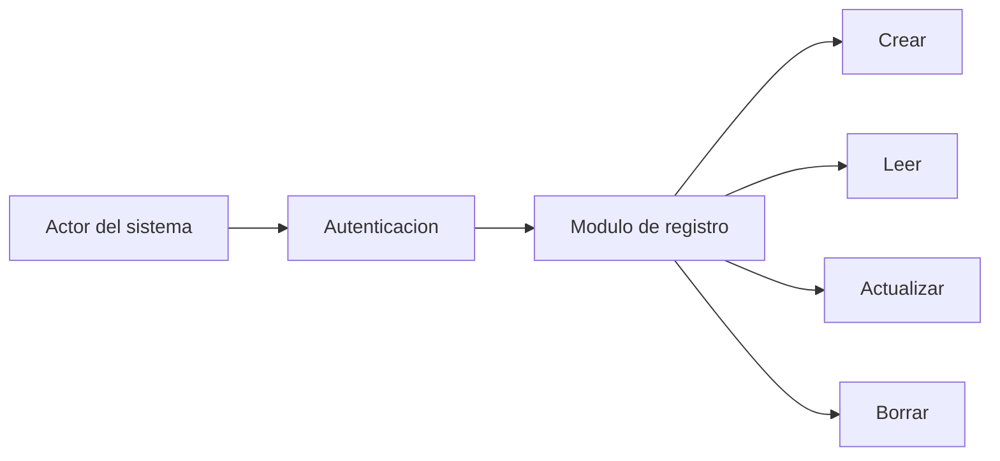
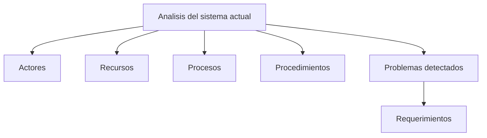
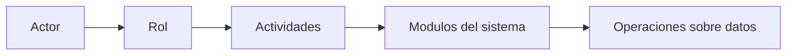
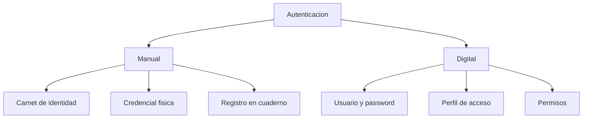
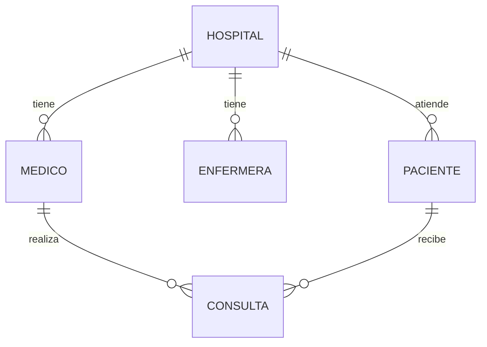
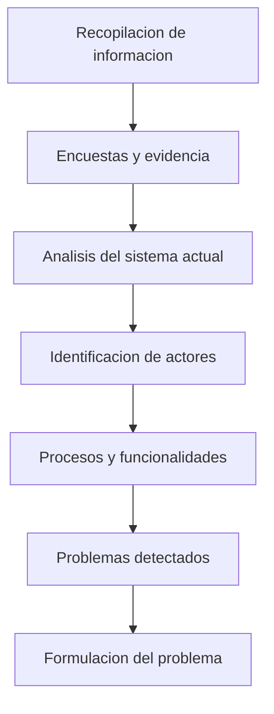

## Preparacion del Proyecto Final

La clase inicio retomando lo trabajado en clases anteriores: la conexion entre **Python** y **MySQL**. El profesor explico que esa parte practica ya permite interactuar con la base de datos, por lo que ahora el siguiente paso es empezar a llevar el proyecto final hacia un entorno de desarrollo mas completo.

> **Profesor:** Ahora nosotros ya hemos logrado conectarnos a la base de datos, podemos interactuar con la base de datos. Ahora lo que yo quiero es que nosotros hagamos nuestro proyecto y empecemos a llevarlo a ese entorno de desarrollo.

El objetivo es comenzar a estructurar el proyecto final, relacionando el diseno de base de datos con los modulos e interfaces que tendra el sistema.

> [!important] Base practica del proyecto
> Para avanzar hacia el proyecto final se debe tener clara la conexion entre Python y MySQL, porque desde ahi se podran implementar las operaciones basicas sobre la base de datos.

### Operaciones Basicas Esperadas

El profesor recordo que el sistema debe poder realizar las operaciones basicas sobre los datos:

| Operacion | Significado |
| --------- | ----------- |
| **Crear** | Insertar nuevos registros |
| **Leer** | Consultar informacion existente |
| **Actualizar** | Modificar registros |
| **Borrar** | Eliminar registros |

Estas operaciones son el conocido **CRUD**, y deben estar asociadas a los modulos del sistema.

---

## Estructura del Documento del Proyecto

El profesor explico que el documento del proyecto debe organizarse por secciones. Una de las primeras partes sera la **introduccion**, seguida de los **antecedentes**.

### Antecedentes

En la seccion de antecedentes se debe colocar toda la evidencia del proceso de recopilacion de informacion del caso de estudio. Esto incluye encuestas, observaciones, resultados y analisis del sistema actual.

> **Profesor:** En antecedentes vamos a colocar toda la evidencia del proceso de la recopilacion de informacion que hemos hecho en relacion a nuestro caso de estudio.

Los antecedentes permiten demostrar si realmente existe un problema que justifique el desarrollo del sistema.

> [!important] Contenido de los antecedentes
> - Evidencia de la recopilacion de informacion
> - Analisis del sistema actual
> - Resultados de encuestas
> - Tabulaciones y graficas
> - Requerimientos encontrados
> - Evidencia del problema

### Analisis del Sistema Actual

El analisis del sistema actual sirve para identificar como se realizan hoy las tareas, procedimientos y registros dentro del caso de estudio. Todavia no se esta desarrollando el sistema nuevo; solo se esta describiendo el funcionamiento actual.

> **Profesor:** No se olviden, cuando estoy hablando de un antecedente todavia no estoy haciendo el desarrollo del sistema, solamente estoy describiendo que estan haciendo.

Este analisis permite identificar:

- **Actores**: personas que participan o usan el sistema.
- **Recursos**: herramientas, documentos o medios usados actualmente.
- **Procesos**: actividades que se realizan.
- **Procedimientos**: pasos concretos que sigue cada actor.
- **Problemas**: fallas, inconsistencias o limitaciones del proceso actual.

---

## Encuestas, Evidencia y Requerimientos

Las encuestas cumplen una funcion central dentro del proyecto. No solo sirven para recopilar opiniones, sino para respaldar la existencia del problema y derivar requerimientos.

El profesor indico que los resultados de las encuestas deben tabularse y graficarse. A partir de esos resultados se puede identificar que necesita el sistema y que problema se esta intentando resolver.

> [!important] Dos resultados esperados de las encuestas
> 1. **Requerimientos** del sistema.
> 2. **Evidencia del problema** que se quiere resolver.

Por ejemplo, si se descubre que los usuarios registran informacion en papel, cuadernos o planillas Excel, eso evidencia un procedimiento manual. Esa informacion justifica el diseno de una base de datos.

| Pregunta de analisis | Posible evidencia |
| -------------------- | ----------------- |
| Donde se registra la informacion? | En papel, planillas o libretas |
| Como se realiza el procedimiento? | Manualmente o con un sistema existente |
| Que problemas existen? | Inconsistencia, redundancia, lentitud |
| Quienes participan? | Actores del sistema |

> **Profesor:** Si en mi sistema ya existe una base de datos, ya no puedo hacer analisis y diseno de base de datos. Tengo que ver si realmente tiene sentido hacer otro sistema.

La idea es justificar el proyecto a partir de una necesidad real. Si todo ya esta resuelto por un sistema eficiente, no tendria sentido proponer otro diseno de base de datos sin demostrar una mejora.

---

## Actores del Sistema

El profesor enfatizo que un **actor** es una persona que interactua con el sistema y cumple un rol dentro de el.

> **Profesor:** El actor va a ser la persona que va a utilizar el sistema. Hay diferentes tipos de actores, pero los actores van a cumplir un rol, un papel importante dentro del sistema.

Un actor no es cualquier elemento del caso de estudio. Debe ser alguien que realiza actividades dentro del sistema o del proceso analizado.

> [!note] Actor
> Un actor es una persona o usuario que interactua con el sistema y realiza actividades especificas segun su rol.

### Relacion entre Actor, Rol y Actividad

Cada actor tiene un rol, y ese rol determina que actividades puede realizar.

| Actor | Rol posible | Actividades posibles |
| ----- | ----------- | -------------------- |
| Administrador | Gestion del sistema | Crear, actualizar o eliminar usuarios |
| Medico | Atencion medica | Diagnosticar, recetar, registrar consultas |
| Secretaria | Gestion operativa | Registrar citas o pacientes |
| Paciente | Usuario atendido | Solicitar consulta o presentar datos |

### Ejemplo: Administrador

El profesor uso el caso del administrador para explicar como se conecta un actor con los modulos del sistema.

Un administrador podria:

- Autenticarse.
- Ingresar al modulo de registro.
- Registrar usuarios.
- Modificar usuarios.
- Eliminar usuarios.

> **Profesor:** Si soy un rol administrativo, probablemente yo voy a tener la capacidad de crear y actualizar usuarios. Entonces tengo que especificar si voy a utilizar el modulo de registro de usuarios.

---

## Procedimientos Manuales y Procedimientos con Sistema

Una parte importante del analisis consiste en determinar si cada procedimiento se realiza de manera manual o mediante un sistema.

El profesor dio ejemplos de procesos manuales:

- Registro en papel.
- Libretas de ventas.
- Planillas Excel.
- Cuadernos de ingreso y salida.
- Agendas fisicas para citas medicas.

> **Profesor:** Las personas que tienen sus ventas normalmente utilizan el papel. Estan registrando cuanto estan vendiendo, cuanto esta saliendo, cuanto esta entrando. Para ese tipo de personas tiene sentido hacer el diseno de una base de datos.

Si un proceso se realiza en papel o en planillas sin control adecuado, se puede justificar el diseno de una base de datos que centralice y organice la informacion.

### Ejemplo: Registro de Usuarios

| Elemento analizado | Ejemplo |
| ------------------ | ------- |
| Actor | Administrador |
| Actividad | Registrar usuarios |
| Medio actual | Planilla, papel o libreta |
| Problema | Informacion dispersa o manual |
| Posible modulo | Modulo de registro de usuarios |

> [!tip] Pregunta guia
> Para cada actor se debe preguntar: que actividades realiza y como las realiza actualmente?

---

## Cuando un Sistema Existente es Deficiente

El profesor aclaro que si una organizacion ya tiene un sistema, no basta con decir que "el sistema es malo". Esa afirmacion no es medible. En cambio, se deben identificar criterios concretos.

> **Profesor:** No puedo decir que el sistema es malo, porque si yo digo que un sistema es malo, tengo que ser capaz de poder medirlo.

Algunos criterios que si pueden analizarse son:

- Informacion inconsistente.
- Informacion redundante.
- Exceso de datos innecesarios.
- Procesos lentos.
- Uso excesivo de recursos.
- Dificultad para generar reportes.

| Afirmacion debil | Afirmacion mejor fundamentada |
| ---------------- | ----------------------------- |
| El sistema es malo | El sistema genera informacion inconsistente |
| No sirve | Tiene informacion redundante |
| Esta mal hecho | Su estructura produce datos duplicados |
| Es lento | Consume mas recursos de los necesarios |

> [!warning] Cuidado con las afirmaciones no medibles
> En el documento del proyecto se deben evitar juicios generales como "el sistema es malo". Se deben usar evidencias medibles: redundancia, inconsistencia, lentitud, errores o consumo excesivo de recursos.

---

## Eficiencia y Eficacia

Durante la clase surgio una discusion sobre la diferencia entre **eficiencia** y **eficacia**.

El profesor explico que ser eficaz significa lograr el objetivo, mientras que ser eficiente implica lograrlo optimizando recursos.

| Concepto | Explicacion |
| -------- | ----------- |
| **Eficacia** | Alcanzar el objetivo usando los recursos disponibles |
| **Eficiencia** | Alcanzar el objetivo usando menos recursos, menos tiempo o mejor optimizacion |

> **Profesor:** Eficiencia va a estar enfocada a lograr los objetivos con el menor recurso posible, optimizando los recursos que tienes.

### Ejemplo de Desarrollo de Software

El profesor planteo un ejemplo: una empresa pide entregar un software en una semana y se tienen cuatro desarrolladores.

| Situacion | Interpretacion |
| --------- | -------------- |
| Se entrega justo al final de la semana usando los cuatro desarrolladores | Es eficaz |
| Se entrega antes del plazo usando los mismos recursos | Puede ser eficiente |
| Se entrega en el plazo usando menos recursos | Puede ser eficiente |
| Se reduce tiempo o recursos sin sacrificar calidad | Hay optimizacion |

> **Profesor:** Si logras tus objetivos con el 100% de tus recursos, eres eficaz. La eficiencia y la eficacia se van a diferenciar en la reduccion de recursos.

> [!important] Aplicacion al proyecto
> Para afirmar que un sistema es deficiente, se debe demostrar que usa mas recursos de los necesarios, genera informacion redundante o produce informacion inconsistente.

---

## Caso de Estudio: Sistema de Salud

El profesor uso un sistema de salud como ejemplo para identificar actores.

### Actores Posibles

En un sistema de salud podrian existir varios actores:

- Medicos.
- Pacientes.
- Secretarias.
- Enfermeras.
- Internistas.
- Administradores.
- Contadores.
- Personal financiero.
- Personal de seguridad fisica.

Un estudiante sugirio "camas" como actor. El profesor aclaro que una cama no puede ser actor porque no interactua con el sistema; es un recurso o atributo del hospital.

> **Profesor:** Camas es un atributo de un hospital, la cantidad de camas. Por lo tanto, camas no entran.

> [!warning] No todo elemento del caso de estudio es actor
> Un actor debe poder interactuar con el sistema. Si el elemento no realiza acciones, puede ser un recurso, atributo, entidad o dato, pero no actor.

### Farmacia y Proveedores

Tambien se discutio si la farmacia o los proveedores deberian considerarse actores. El profesor explico que depende del alcance del sistema. La gestion de medicamentos, inventarios o proveedores podria quedar dentro del area administrativa.

| Elemento | Puede ser actor? | Observacion |
| -------- | ---------------- | ----------- |
| Medico | Si | Interactua con el sistema |
| Paciente | Si | Puede solicitar o recibir atencion |
| Secretaria | Si | Registra citas o pacientes |
| Cama | No | Es un recurso o atributo |
| Farmaceutico | Depende | Si interactua con el sistema de farmacia |
| Proveedor | Depende | Podria ser externo o parte de inventarios |

---

## Autenticacion Manual y Autenticacion en Sistema

El profesor explico que la autenticacion no siempre implica una pantalla de login. Tambien existen formas manuales de identificacion.

> **Profesor:** Hay procedimientos manuales para autentificarse. Una credencial que vas a mostrar fisicamente.

Ejemplos de autenticacion manual:

- Carnet de identidad.
- Credencial institucional.
- Carnet universitario.
- Registro fisico en ingreso.
- Verificacion por personal de seguridad.

Ejemplos de autenticacion en sistema:

- Usuario y contrasena.
- Validacion de credenciales.
- Perfil de acceso.
- Control de permisos.

> [!note] Analisis del proceso actual
> Aunque el futuro sistema tenga login digital, en los antecedentes se debe describir como se autentican actualmente los actores.

---

## Sistemas Centralizados y Entidades Parametrizables

En la discusion sobre hospitales y clinicas con varias sedes, el profesor explico que se puede manejar un solo sistema y un solo servidor al que acceden diferentes instituciones o unidades.

La base de datos debe contemplar ese escenario mediante entidades parametrizables. Por ejemplo, una tabla `hospital` podria permitir registrar varias sedes, y cada sede podria tener sus propios medicos, enfermeras y pacientes.

> **Profesor:** Tu base de datos cuando la disenes tiene que contemplar eso. Tengo que tener en una tabla justamente la entidad de hospitales y que cada hospital tenga sus medicos, sus enfermeras y todo lo demas.

### Ejemplo Conceptual

El profesor comparo este caso con el sistema universitario: un docente podria dar clases virtuales a estudiantes de otra ciudad sin que se cree un perfil nuevo del docente. El sistema puede reutilizar su perfil y asociarlo a otra asignatura o sede.

> [!tip] Diseno parametrizable
> Cuando una organizacion tiene sedes, unidades o sucursales, conviene contemplarlas como entidades dentro de la base de datos para evitar duplicar perfiles o informacion.

---

## Analisis por Cada Actor

El cierre de la clase se centro en una indicacion practica: cada estudiante debe identificar los actores de su sistema y analizar que hace cada uno.

> **Profesor:** Cada uno de estos actores tiene que tener su analisis de los procesos y funcionalidades que tiene.

Para cada actor se debe registrar:

| Pregunta | Proposito |
| -------- | --------- |
| Quien es el actor? | Identificar el usuario o rol |
| Que actividades realiza? | Determinar funcionalidades |
| Como realiza esas actividades actualmente? | Detectar si es manual o con sistema |
| Que informacion maneja? | Identificar datos y posibles tablas |
| Que problemas existen? | Formular requerimientos |

### Ejemplo: Medico

El profesor explico que el medico, despues de autenticarse, no necesariamente realizara las mismas acciones que un administrador.

Un medico podria:

- Autenticarse.
- Revisar datos del paciente.
- Realizar diagnostico.
- Generar receta.
- Registrar consulta.
- Gestionar reconsulta.

> **Profesor:** El medico puede realizar receta, pero antes de realizar la receta va a sacar un diagnostico. Cada actor tiene sus propios procedimientos y funciones.

### Ejercicio de Clase

El profesor pidio que los estudiantes hagan el ejercicio de identificar actores y funciones de su propio sistema, ya sea en papel o en computadora.

> [!todo] Ejercicio
> Para el proyecto final, identificar todos los actores del sistema y describir:
> - Que funciones realiza cada actor.
> - Como se realiza actualmente cada funcion.
> - Si el proceso es manual, con planillas o con sistema.
> - Que problemas se observan.
> - Que modulos del nuevo sistema podrian surgir.

---

## Relacion con la Formulacion del Problema

El profesor explico que este analisis de antecedentes, actores y procedimientos es necesario antes de pasar a la **formulacion del problema**.

Primero se debe entender el contexto actual; despues se podra formular correctamente el problema que el sistema va a resolver.

> [!important] Secuencia para el proyecto
> Antes de formular el problema, se debe demostrar como funciona actualmente el caso de estudio, quienes participan, que procedimientos realizan y que fallas justifican el nuevo sistema.

---

## Resumen de la Clase

La clase se enfoco en preparar la estructura del proyecto final y en explicar como analizar el sistema actual antes de disenar una base de datos o una aplicacion.

Puntos principales:

- El proyecto debe apoyarse en la conexion previa entre Python y MySQL.
- El documento debe incluir introduccion y antecedentes.
- Los antecedentes deben contener evidencia del levantamiento de informacion.
- Las encuestas sirven para identificar requerimientos y demostrar el problema.
- Se debe analizar el sistema actual antes de proponer el sistema nuevo.
- Los actores son personas que interactuan con el sistema.
- Cada actor tiene roles, procesos y funcionalidades propias.
- No todo elemento del dominio es actor; algunos son recursos o atributos.
- Si ya existe un sistema, se debe demostrar con evidencia por que es deficiente.
- La diferencia entre eficacia y eficiencia esta en la optimizacion de recursos.
- El analisis por actor ayuda a construir los modulos del sistema y a formular el problema.
